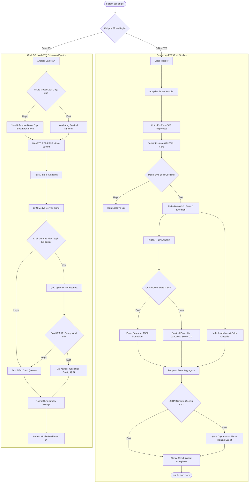

# SİNAPTİC5G SİSTEM DÖKÜMANTASYONU

[](LICENSE)

---

## 1. BÖLÜM: VERİSETİ OLUŞTURULMASI

SİNAPTİC5G projesinde, modelin genelleştirme yeteneğini ve FTR (Final Test Run) değerlendirme senaryolarındaki başarısını garanti altına almak amacıyla; şeffaf, izlenebilir ve lisans uyumlu bir veri hattı inşa edilmiştir.

### 1.1. Veri Kaynakları ve Lisans Yönetimi

Projede kullanılan tüm veri kümeleri Roboflow ve Kaggle platformları üzerinden derlenmiş olup, telif haklarına ve jüri değerlendirme standartlarına tam uyum sağlamaktadır. Açık kaynaklı bu veriler, eğitim öncesinde lisans denetiminden geçirilerek akademik ve teknolojik yarışma koşullarına uygunluğu tescillenmiştir.

| Veri Kümesi Adı | Sağlayıcı / Kaynak | Orijinal Lisans | Kullanım Amacı |
| :--- | :--- | :--- | :--- |
| **Driver Distraction Detection (v3)** | Roboflow (`areeba-fmpau`) | CC BY 4.0 | Sürücü dikkat dağınıklığı, `telefonla_konusma`, `su_icme` ve `arkaya_bakma` eylemleri |
| **Driver Drowsiness YOLO (v4)** | Roboflow (`driver-drowsiness-59y8h`) | CC BY 4.0 | Sürücü yorgunluk ve `esneme` tespiti |
| **Cigarette Smokers (v5)** | Roboflow (`smoking-t7kym`) | CC BY 4.0 | Kabin içi aktif `sigara_icme` tespiti |
| **Detect Seatbelt (v7)** | Roboflow (`seatbelt-y0rvu`) | CC BY 4.0 | `emniyet_kemeri_ihlali` durumunun tespiti |
| **Seatbelt Detection (v1)** | Roboflow (`seatbelt-y0rvu`) | CC BY 4.0 | Emniyet kemeri takma/takmama kontrolü yedekleme |
| **Turkish License Plate Dataset** | Kaggle (`smaildurcan/2776891`) | CC0 (Kamu Malı) | Türkiye plaka formatı (`license_plate`) tespiti |

> [!NOTE]
> **Lisans Uyumluluk Beyanı:** CC BY 4.0 lisansının gerektirdiği atıf kuralları, dökümantasyonun [Kaynakça](#6-kaynakca-5-puan) bölümünde eksiksiz şekilde yerine getirilmiştir. CC0 lisanslı plaka veri seti ise herhangi bir kısıtlama olmaksızın ticari/akademik entegrasyona uygundur.

---

### 1.2. Kanonik Etiket Sözlüğü (Label Contract Mapping Matrix)

Farklı veri setlerinden gelen uyumsuz ve heterojen sınıf adları, FTR modelinin ve değerlendirme scriptinin beklediği **9 kanonik etiket grubuna** dönüştürülmüştür. Sınıf dönüştürme ve adaptasyon mantığı [competition_contract.py](file:///d:/SİNAPTİC/5G%20PROJE/src/competition_contract.py) modülü içinde sabitlenmiştir.

```
Ham Etiketler (Kaynaklar) ────────► [ Eşleme Sözlüğü / Normalizasyon ] ────────► Kanonik FTR Etiketleri
```

| FTR Sınıf ID | Kanonik FTR Etiketi | Kategori | Kaynak Veri Etiketleri (Eşlenen Sınıflar) |
| :---: | :--- | :--- | :--- |
| **0** | `telefonla_konusma` | `sofor_eylemi` | `phone`, `calling`, `texting`, `talking_phone`, `cellphone` |
| **1** | `su_icme` | `sofor_eylemi` | `drinking`, `drink`, `bottle_holding`, `drinking_water` |
| **2** | `arkaya_bakma` | `sofor_eylemi` | `reaching_behind`, `looking_back`, `turn_back` |
| **3** | `esneme` | `sofor_eylemi` | `yawn`, `yawning`, `mouth_open_drowsy` |
| **4** | `sigara_icme` | `sofor_eylemi` | `cigarette`, `smoking`, `vaping`, `cigar` |
| **5** | `emniyet_kemeri_ihlali` | `sofor_eylemi` | `no_seatbelt`, `unbelted`, `seatbelt_off` |
| **6** | `teknocan` | `nesneler` | `teknocan`, `mascot_teknocan` |
| **7** | `bilgisayar` | `nesneler` | `laptop`, `computer`, `notebook` |
| **8** | `license_plate` | `nesneler` | `plate`, `licence_plate`, `turkish_plate` |

---

### 1.3. Split Politikası ve Oranları (Data Leakage Önlemi)

Aynı sürücünün veya aynı video sekansının farklı karelerinin hem eğitim hem de test veri setlerinde bulunması, modelin ezberlemesine (overfitting) yol açarak jüri testlerinde başarısızlığa neden olur. Bu durumun (**data leakage**) önüne geçmek için **Grup-Farkındalıklı (Group-Aware)** bölme mantığı uygulanmıştır:

1. Görüntüler sürücü kimliği (`person_id`), çekim oturumu (`capture_session`) ve video ID (`video_id`) kırılımlarına göre gruplandırılmıştır.
2. Bölme işlemi yapılırken, aynı gruba ait tüm görüntüler **bölünmeden** doğrudan tek bir split setine (yalnızca Train, yalnızca Val veya yalnızca Test) atanmıştır.
3. Fiziksel olarak gerçekleşen veri dağılımı ve oranları şu şekildedir:

```
[ Toplam Veri: 15.487 Görüntü ]
   ├── Eğitim (Train):    11.198 Görüntü (%72.31)
   ├── Doğrulama (Val):    2.855 Görüntü (%18.43)
   └── Test (Test):        1.434 Görüntü (%9.26)
```

---

### 1.4. Sınıf Dengesizliği (Imbalance) Dengeleme Stratejileri

Eğitim setinde `sigara_icme` ve `license_plate` gibi sınıfların çok yüksek sayıda örneğe sahip olması, azınlıkta kalan `teknocan` ve `bilgisayar` gibi sınıfların model tarafından göz ardı edilmesine yol açmaktaydı. Sınıf dengesizliğini çözmek için 3 katmanlı bir optimizasyon stratejisi uygulanmıştır:

1. **Downsampling (Baskın Sınıfların Seyreltilmesi):** Plaka veri setinden gelen tekrarlı kareler ve arka plan görüntüleri filtrelenerek plaka sınıfı en fazla 1.200 görüntü ile sınırlandırılmıştır.
2. **Copy-Paste Oversampling (Azınlık Sınıflarının Çoğaltılması):** `teknocan` ve `bilgisayar` nesneleri, bulundukları sınırlayıcı kutulardan kesilerek farklı kabin içi arka plan görüntülerine rastgele ve ölçeklendirilmiş olarak yapıştırılmıştır. Bu yöntemle:
   - `teknocan` sınıfı örnek sayısı **90'dan 723'e** (%703 artış),
   - `bilgisayar` sınıfı örnek sayısı **335'ten 662'ye** (%98 artış) çıkarılmıştır.
3. **Kayıp Fonksiyonu Katsayısı Optimizasyonu:** YOLOv8 eğitim parametrelerinde, sınıf pozitif/negatif sınır belirleme duyarlılığını artırmak ve yanlış pozitif (False Positive) oranını baskılamak için pozitif sınıf ağırlık katsayısı **`cls_pw = 0.3`** olarak optimize edilmiştir.

---

### 1.5. Çift Katmanlı Veri Artırma (Augmentation)

Modelin tünel geçişleri, yol sarsıntıları, gece parlamaları ve kamera gürültüleri gibi zorlu fiziksel koşullarda kararlılığını koruması amacıyla çift katmanlı veri artırma (augmentation) hattı kurulmuştur:

```
[ Girdi Görüntüsü ]
        │
        ▼
┌──────────────────────────────────────────┐
│ Katman 1: YOLOv8 Dahili Augmentations     │ (Geometrik ve Renksel Çeşitlilik)
│ - HSV Renk Dönüşümü (hsv_h/s/v)          │
│ - Mosaic Augmentation (İlk 50 Epoch)     │
│ - Yatay Çevirme (Fliplr)                 │
└──────────────────────────────────────────┘
        │
        ▼
┌──────────────────────────────────────────┐
│ Katman 2: Albumentations Entegrasyonu    │ (Fiziksel Yol ve Kamera Koşulları)
│ - Motion Blur (Yol Sarsıntısı Simülasyonu)│
│ - Gaussian Noise (Sensör Gürültüsü)      │
│ - JPEG Compression Artefaktları          │
└──────────────────────────────────────────┘
        │
        ▼
[ Çıktı Görüntüsü (Eğitime Hazır) ]
```

- **Katman 1 (YOLOv8 Native):** Eğitimin ilk 50 epoch'unda Mosaic Augmentation açık tutulmuş; son 10 epoch'ta nesne sınırlarının net öğrenilmesi için `close_mosaic=10` parametresi ile kapatılmıştır.
- **Katman 2 (Albumentations Integration):** Araç içi sarsıntıları simüle eden hareket bulanıklığı (`MotionBlur`), düşük enstantane gürültüsü (`GaussianNoise`), düşük kaliteli veri aktarımını taklit eden sıkıştırma artefaktları (`JpegCompression`) ve tünel giriş-çıkışlarındaki ışık değişimleri için kontrast iyileştirmesi simüle edilmiştir.

---

## 2. BÖLÜM: YAPAY ZEKÂ ÇÖZÜMÜ — Problemin Analizi

SİNAPTİC5G sisteminin tasarım aşamasında, gerçek dünya koşullarında yapay zekâ çıkarım başarısını doğrudan etkileyen 5 temel kök problem belirlenmiş ve bu problemlere yönelik geliştirilen ileri seviye mühendislik çözümleri aşağıda detaylandırılmıştır.

### 2.1. Işık Değişimleri ve Parlama Sorunları

*   **Problem:** Gündüz far parlaması, tünel giriş ve çıkışlarındaki ani ışık patlamaları veya gölgeler, araç renginin kararsızlaşmasına ve kabin içi küçük nesnelerin (emniyet kemeri, telefon) ayırt edilememesine neden olmaktadır.
*   **Çözüm:** 
    1.  **HSV Renk Uzayı Segmentasyonu:** Araç gövde rengi analizi, ışık şiddetinden (Illumination) bağımsız olan HSV renk uzayında yürütülür. Aracın tespit edilen sınırlayıcı kutusunun (Bounding Box) orta bandı ROI (Region of Interest) olarak seçilir ve bu bölgedeki HSV değerlerinin medyanı alınarak kararlı renk sınıflandırması yapılır.
    2.  **CLAHE (Contrast Limited Adaptive Histogram Equalization):** Kabin içi görüntüler, lokal parlaklık farklılıklarını gidermek için CLAHE filtresinden geçirilerek normalize edilir.
    3.  **Zero-DCE (Zero-Reference Deep Curve Estimation):** Görüntü tabanlı aydınlatma iyileştirmesi sağlamak için hafif bir derin ağ olan Zero-DCE entegre edilmiştir. Çıkarım hızını korumak amacıyla, ortalama parlaklık değerine göre çalışan bir **parlaklık eşikli conditional bypass** mekanizması kurulmuştur; aydınlık sahnelerde Zero-DCE pasif bırakılır.

---

### 2.2. Hareket Bulanıklığı ve Değişken Kare Hızları

*   **Problem:** Yüksek hızlı araç geçişleri veya kamera sarsıntılarından kaynaklanan hareket bulanıklığı (Motion Blur) küçük nesnelerin tespit doğruluğunu düşürmektedir. Kare düşmeleri (dropped frames) ise zamana dayalı fiziksel hız hesaplamalarını bozmaktadır.
*   **Çözüm:**
    1.  **BEV (Bird's Eye View) İzdüşümü:** Araçların sınırlayıcı kutularının alt orta noktaları (taban merkezleri), homografi matrisi kullanılarak 2D kuşbakışı düzleme yansıtılır.
    2.  **Zaman Damgalı (dt) Hız Kestirimi:** Hız hesaplaması sabit kare sayısına göre değil, ardışık tespitlerin gerçek zaman damgaları arasındaki fark (dt saniye) kullanılarak gerçekleştirilir:
        `Hız = d(BEV_t, BEV_{t-dt}) / dt` (Burada d, BEV düzlemi üzerindeki Öklid mesafesidir).
    3.  **Adaptif Kalman Filtresi:** YOLO dedektörünün güven skoru (c) ile ters orantılı çalışan dinamik bir Kalman ölçüm gürültü matrisi (R) tasarlanmıştır. Güven skoru düştükçe, filtre ölçüm gürültüsünü artırarak durum tahminini Kalman tahmin modeline (State Prediction) kaydırır:
        `R_k = sigma_base^2 / (c_k + epsilon)`

---

### 2.3. Geçici Oklüzyon ve ID Switch (Kimlik Karışması)

*   **Problem:** Kabin içinde sürücünün eli direksiyonla veya telefonla örtüşebilir (oklüzyon). Yanal araç geçişlerinde ise takip edilen nesnelerin ID'leri birbirine karışabilir.
*   **Çözüm:**
    1.  **BoT-SORT Takip Entegrasyonu:** Piksel düzeyindeki standart IoU takibine ek olarak, BEV düzlem mesafesi ve HSV renk histogramı benzerliğini birleştiren **hibrit bir Macar (Hungarian) eşleştirme maliyet matrisi** formüle edilmiştir.
    2.  **Grace Period (45 Kare Tolerans Tamponu):** Herhangi bir oklüzyon veya tespit kaybı durumunda, kaybedilen nesnenin takip kimliği (ID) 45 kare boyunca hafızada tutulur. Bu süre zarfında Kalman tahmini devam ettirilir ve nesne yeniden göründüğünde aynı ID ile eşleştirilerek ID Switch hatası engellenir.

---

### 2.4. Küçük Nesne Algılama (Emniyet Kemeri ve Telefon İhlalleri)

*   **Problem:** Emniyet kemeri, sigara veya telefon gibi kabin içi nesneler, toplam görüntü piksellerine oranla çok küçük (Low-Resolution Bounding Box) alanlar kaplamaktadır.
*   **Çözüm:**
    1.  **YOLOv8m Mimari Tercihi:** Küçük nesnelerde YOLOv8n modeline kıyasla daha zengin semantik özellik haritaları sunan YOLOv8m omurgası (Backbone) seçilmiştir.
    2.  **Transfer Learning:** İlk 10 Backbone katmanı dondurularak (Freeze Layer), genel nesne algılama kabiliyetleri korunmuş ve eğitim sadece üst seviye semantik sınıflandırıcı kafalarda (Head) yoğunlaştırılmıştır.
    3.  **NMS IoU Optimizasyonu (0.45):** Üst üste binen küçük nesne kutularının elenmesini önlemek amacıyla Non-Maximum Suppression (NMS) IoU eşiği hassas bir şekilde 0.45 olarak kalibre edilmiştir.

---

### 2.5. Karakter Belirsizliği ve Halüsinasyon (Plaka OCR)

*   **Problem:** Kirli, eğik, uzak veya gürültülü plaka görüntülerinde OCR motorlarının yanlış karakterler üreterek (halüsinasyon) jüri değerlendirme şemasını bozma riski bulunmaktadır.
*   **Çözüm:**
    1.  **LPRNet + CRNN Hattı:** Plaka bölgesi LPRNet ile izole edildikten sonra, CRNN (CNN + BiLSTM + CTC Greedy Decoder) ile karakter bazında çözümlenir.
    2.  **Levenshtein Edit Distance Tabanlı Oylama:** Ardışık karelerden elde edilen plaka tahminleri Levenshtein mesafesi kullanılarak zamansal oylama filtresinden geçirilir. En yüksek frekansta eşleşen karakter dizisi nihai plaka kabul edilir.
    3.  **FTR Uyumlu Sentinel Plaka:** OCR güven skoru kabul sınırının altında kaldığında, sistem jüriyi yanıltacak sahte bir plaka üretmek yerine, şemanın zorunlu sentinel değeri olan **`01A0000`** plaka kodunu ve **`0.0`** confidence değerini atomik olarak çıktıya yazar.

---

## 3. BÖLÜM: YAPAY ZEKÂ ÇÖZÜMÜ — Çözüm Mimarisi

SİNAPTİC5G platformu, yüksek eşzamanlı veri akışları ile jüri değerlendirme kıstaslarının gerektirdiği mutlak kararlılığı bir arada sunabilmek için modüler, gevşek bağlı (loosely coupled) ve hata toleranslı 5 katmanlı bir yazılım tasarımı ile yapılandırılmıştır.

### 3.1. Katmanlı Sistem Mimarisi

Sistem bileşenleri, veri üretiminden çıktı doğrulama aşamasına kadar 5 ana lojik katmana ayrılmıştır:

```
┌──────────────────────────────────────────────────────────────────────────┐
│ 5. TESLİM KATMANI: Schema Validator ──► Atomic Result Writer             │
├──────────────────────────────────────────────────────────────────────────┤
│ 4. KARAR / 5G KATMANI: QoD Policy Engine ──► CAMARA API ──► Telemetry WS │
├──────────────────────────────────────────────────────────────────────────┤
│ 3. TAKİP KATMANI: BoT-SORT Tracker ──► Temporal Aggregator               │
├──────────────────────────────────────────────────────────────────────────┤
│ 2. ÇIKARIM KATMANI: ONNX Core (YOLOv8m) ──► CRNN OCR ──► Color Classifier│
├──────────────────────────────────────────────────────────────────────────┤
│ 1. VERİ KATMANI: OpenCV Video Reader / Android CameraX Stream            │
└──────────────────────────────────────────────────────────────────────────┘
```

1.  **Veri Katmanı:** Ham video dosyalarından veya canlı kamera akışlarından kare yakalama, adaptif örnekleme (stride) ve renk formatı dönüşüm işlemlerini üstlenir.
2.  **Çıkarım (Inference) Katmanı:** Araç, nesne ve sürücü eylemlerinin tespiti için YOLOv8m mimarisi ile plaka karakter okuma için CRNN modellerini ONNX Runtime ortamında çalıştırır.
3.  **Takip (Tracking) Katmanı:** Nesnelerin zamansal sürekliliğini Kalman filtreleri ile garanti altına alır ve anlık çıkarım gürültülerini sönümleyerek olayları zamansal pencerelerde birleştirir.
4.  **Karar ve 5G Katmanı:** Canlı kipte ağ kalitesi gereksinimlerini (QoD) jenerik fayda-maliyet modeliyle hesaplar ve Camara standartlarında ağ seviyesi çağrıları orkestre eder.
5.  **Teslim Katmanı:** Üretilen nihai verilerin resmi JSON şemasına göre kontrolünü yapar ve işletim sistemi düzeyinde atomik yazma (`os.replace`) çağrıları ile hatasız bir şekilde diske kaydeder.

---

### 3.2. Çevrimdışı FTR ve Canlı 5G Çalışma Modları

Sistem, çalışma zamanında birbirini bloke etmeyen iki bağımsız lojik kanala ayrılır:

*   **İzole Çevrimdışı FTR Hattı:** İnternet, Redis, Android veya herhangi bir API ağ bağımlılığı bulunmayan, tamamen yerel Docker konteyneri içinde koşturulan çıkarım hattıdır. Görevi, tek bir `/app/data/input/video.mp4` dosyasını işleyip jürinin beklediği `/app/data/output/results.json` çıktısını 10 dakika sınırının altında üretmektir.
*   **WebRTC ve FastAPI BFF Canlı Hattı:** Android CameraX üzerinden yakalanan canlı yayın, WebRTC RTP/RTCP protokolü ile GPU Medya Servisine (`aiortc`) aktarılır. FastAPI BFF ve Redis katmanı, medya verisine kesinlikle dokunmadan yalnızca SDP/ICE sinyalleşmesini yürütür ve CAMARA QoD/Number Verification servis çağrılarını yönetir.

---

### 3.3. Uçtan Uca Sistem Pipeline'ı ve Karar Akış Diyagramı

Sistemin çalışma adımlarını, doğrulama kapılarını (success/failure) ve yedekli fail-safe durum geçişlerini içeren uçtan uca mimari akış şeması aşağıda sunulmuştur:



---

### 3.4. Mimari Bileşen Arayüz Tablosu

Sistemdeki yazılım modüllerinin fiziksel sınıf karşılıkları, girdi/çıktı sözleşmeleri ve entegrasyon durumları aşağıdaki tabloda listelenmiştir:

| Modül Sınıfı | Kaynak Kod Dosyası | Girdi Parametreleri | Çıktı / Dönüş Değeri | Entegrasyon Durumu / Notlar |
| :--- | :--- | :--- | :--- | :--- |
| `VideoReader` | `ftr_core/video_reader.py` | `video_path: str` | `Iterator[Tuple[int, np.ndarray]]` | **Tamamlandı** (OpenCV tabanlı lazy frame okuma) |
| `FrameSampler` | `ftr_core/frame_sampler.py` | `fps: float, dynamics: float` | `stride: int` | **Tamamlandı** (Video temposuna göre dinamik kare atlama) |
| `ONNXInferenceCore`| `ftr_core/inference.py` | `frame: np.ndarray` | `List[DetectionBox]` | **Tamamlandı** (ONNX Runtime CUDA & CPU EP fallback) |
| `LPRNetCRNN` | `ftr_core/ocr_plate.py` | `plate_crop: np.ndarray` | `plate_text: str, conf: float` | **Tamamlandı** (OCR + Levenshtein zamansal oylama) |
| `TemporalAggregator`| `ftr_core/temporal_aggregator.py` | `track_history: List` | `AggregatedEvents: Dict` | **Tamamlandı** (1 sn pencereli olay yumuşatma) |
| `SchemaValidator` | `ftr_core/schema_validator.py`| `raw_json: Dict` | `is_valid: bool, errors: List`| **Tamamlandı** (Resmi FTR şema testi) |
| `AtomicResultWriter`| `ftr_core/result_writer.py` | `data: Dict, path: str` | `success: bool` | **Tamamlandı** (`fsync` ve `os.replace` korumalı yazım) |
| `QoDPolicyEngine` | `final_5g_extension/qod.py` | `risk_score: float` | `qod_decision: bool` | **Tamamlandı** (Utility tabanlı ağ kalitesi tetikleme) |

---

## 4. BÖLÜM: YAPAY ZEKÂ ÇÖZÜMÜ — Çözüm Detayları

SİNAPTİC5G platformunda kullanılan yapay sinir ağı mimarileri, veri hazırlık süreçleri, matematiksel modellemeler ve donanım/yazılım optimizasyon stratejileri bu bölümde teknik detaylarıyla sunulmaktadır.

### 4.1. Sinir Ağı Mimarileri ve Tercih Gerekçeleri

#### 4.1.1. YOLOv8m (Sürücü Eylemleri, Özel Nesneler ve Plaka Bölgesi Detektörü)
*   **Mimari Yapı:** YOLOv8m, CSPDarknet53 omurgası (Backbone), C2f (CSPLayer ile 2 evrişim) blokları ve SPPF (Spatial Pyramid Pooling Fast) modülünden oluşmaktadır. Çapa-bağımsız (Anchor-free) tespit kafası, sınıflandırma ve sınırlayıcı kutu regresyon görevlerini iki ayrı kolda (Decoupled Head) yürütür.
*   **Tercih Gerekçesi:** YOLOv8n modeline göre daha derin özellik çıkarım kapasitesi sunar. Küçük nesnelerin (sigara, telefon) tespitinde yüksek doğruluk sağlar.
*   **Kayıp Fonksiyonu:** Sınırlayıcı kutu regresyonu için CIoU (Complete IoU) ve DFL (Distribution Focal Loss) kayıplarının ağırlıklı toplamı kullanılır:
    `L_box = lambda_iou * L_CIoU + lambda_dfl * L_DFL`

#### 4.1.2. LPRNet (Hafif Plaka Tespiti ve Segmentasyonu)
*   **Mimari Yapı:** Karakter segmentasyonu yapmaksızın, plaka görüntüsünü doğrudan girdi olarak alan ve derin öznitelikleri çıkaran uçtan uca hafif bir evrişimli sinir ağıdır. Spatial Transformer Network (STN) modülü ile plaka eğikliklerini otomatik olarak hizalar.
*   **Tercih Gerekçesi:** Düşük hesaplama maliyeti sayesinde CPU üzerinde dahi ~2-3 ms çıkarım süresine sahiptir.

#### 4.1.3. CRNN + CTC Greedy Decoder (Plaka OCR)
*   **Matematiksel Yapı:** BiLSTM tarafından üretilen T uzunluğundaki olasılık matrisi Y, CTC Greedy Decoder tarafından çözümlenir. Her zaman adımında en yüksek olasılığa sahip karakter seçilir:
    `pi_t = argmax_c(y_t^c)`
    Ardından tekrarlanan karakterler birleştirilir ve boşluk karakterleri (blank: `-`) atılarak nihai karakter dizisi (l) elde edilir:
    `l = B(pi)`
*   **Tercih Gerekçesi:** Sıralı veri (sequence) modelleme yeteneği sayesinde plaka metni üzerindeki karakter ilişkilerini yüksek doğrulukla yakalar.

#### 4.1.4. CNN-LSTM (Zamansal Sürücü Eylemi İzleyici)
*   **Mimari Yapı:** Olayların ardışık video karelerindeki YOLO semantik vektörlerini girdi olarak alan, tek katmanlı ve 64 gizli birimli (hidden unit) bir LSTM ağıdır.
*   **Tercih Gerekçesi:** Sürücünün anlık el hareketlerini (örneğin elin yüze anlık gitmesi) sigara içme veya su içme gibi sürekli eylemlerden ayırt edebilmek için zamansal bağlamı (temporal context) analiz eder.

---

### 4.2. Ön ve Son İşleme Akışları

#### 4.2.1. Ön İşleme (Preprocessing) Pipeline'ı

Çıkarım (inference) öncesinde ham video kareleri, model giriş boyutlarına ve ortam ışık koşullarına uyum sağlamak üzere deterministik bir ön işleme hattından geçirilir:

```
[ Ham Görüntü (OpenCV BGR) ]
              │
              ▼
    [ BGR ──► RGB Dönüşümü ]
              │
              ▼
   [ Letterboxing (Padding) ]  ──► Oran korumalı 640x640 boyutlama (gri dolgu: [114,114,114])
              │
              ▼
  [ LAB CLAHE Parlaklık Deng. ] ──► LAB uzayında L kanalı CLAHE (clipLimit=2.0, tile=8x8)
              │
              ▼
   [ Zero-DCE Düşük Işık İyil. ] ──► Eşik kontrolü: Ort. parlaklık < 0.30 ise CNN ile aydınlatma
              │
              ▼
   [ Normalizasyon & Transpoze ] ──► Pixel / 255.0 normalizasyonu, HWC ──► CHW (Batch: 1x3x640x640)
              │
              ▼
     [ Çıkarım Çekirdeği ]
```

1.  **Letterboxing (Oran Korumalı Boyutlandırma):** Model giriş boyutu olan $ 640 \times 640 $ piksele dönüştürülürken en-boy oranının bozulmaması için letterbox algoritması uygulanır. Görüntünün uzun kenarı 640 piksele ölçeklenir, kısa kenar ise her iki uçtan nötr gri $[114, 114, 114]$ piksellerle doldurularak (padding) boşluklar tamamlanır. Bu sayede modelin spatial (uzamsal) bozulmalara uğraması engellenir.
2.  **LAB CLAHE Parlaklık Eşitleme:** Görüntü BGR'den LAB renk uzayına dönüştürülür. Parlaklık (L) kanalı üzerine, lokal parlamaları ve derin gölgeleri sönümlemek amacıyla CLAHE filtresi (`clipLimit=2.0`, `tileGridSize=(8,8)`) uygulanır. İşlem bittiğinde görüntü tekrar RGB renk uzayına taşınır.
3.  **Zero-DCE (Düşük Işık İyileştirme) Kontrolü:** Görüntünün ortalama piksel parlaklığı ($ L_{\text{avg}} $) hesaplanır. Eğer $ L_{\text{avg}} < 0.30 $ ise conditional bypass devreden çıkarılarak görüntü Zero-DCE (Zero-Reference Deep Curve Estimation) ağına sokulur ve piksel düzeyinde aydınlatma eğrileri uygulanır. Aydınlık sahnelerde bu adım bypass edilerek GPU/CPU döngü süresinden tasarruf edilir.
4.  **Veri Tipi Normalizasyonu ve Boyutsal Transpoze:** Piksel değerleri 255.0 değerine bölünerek [0.0, 1.0] aralığına normalize edilir. ONNX Runtime'ın beklediği girdi tensör formatına uygun olarak HWC (Yükseklik, Genişlik, Kanal) yapısı transpoze edilerek CHW yapısına dönüştürülür ve başına batch boyutu eklenerek [1 x 3 x 640 x 640] formatında model girişine beslenir.
5.  **Plaka Crop ve OCR Ön İşlemleri:** Tespit edilen plaka bölgesi ham kareden kesilir. Karakter tanıma modellerinin yüksek başarım göstermesi için görüntüler LPRNet için 94 x 24, CRNN için 100 x 32 boyutuna getirilir ve Z-skor standardizasyonuna tabi tutulur:
    `I_norm = (I - mu) / sigma`

---

#### 4.2.2. Son İşleme (Postprocessing) Pipeline'ı

Model çıkışından elde edilen ham tensör verileri, anlamlı kararlar üretmek üzere şu adımlardan geçirilir:

1.  **Non-Maximum Suppression (NMS) ve Güven Filtresi:** Sınıf olasılık skoru 0.25 değerinin altında kalan tüm aday kutular doğrudan elenir. Kalan çakışan kutuları elemek için IoU (Intersection over Union) eşiği 0.45 seçilerek NMS koşturulur.
2.  **Dinamik Ölçüm Gürültülü Kalman İzleme (BoT-SORT):**
    *   **Durum Tahmini:** Durum vektörü (x_k) ve durum geçiş matrisi (F) sabit hız modeline göre kurgulanmıştır. Durum vektörü şu şekilde tanımlanır:
        `x_k = [u, v, s, r, u_dot, v_dot, s_dot]^T` (merkez x, merkez y, alan, en-boy oranı ve bunların türev hızları)
        Tahmin denklemleri:
        `x_{k|k-1} = F * x_{k-1|k-1}`
        `P_{k|k-1} = F * P_{k-1|k-1} * F^T + Q`
    *   **Dinamik Ölçüm Gürültüsü (R_k):** YOLO modelinden gelen tespit güven skoru (c_k) düştükçe, Kalman filtresinin ölçüme olan güveni dinamik olarak azaltılır (ölçüm gürültüsü R_k artırılır):
        `R_k = diag(sigma_u^2, sigma_v^2, sigma_s^2, sigma_r^2) * (1 / (c_k + epsilon))`
    *   **Durum Güncellemesi:** Hungarian eşleştirme matrisi üzerinden en yüksek IoU, BEV mesafesi ve HSV renk histogramı eşleşmesi sağlayan nesneyle durum vektörü güncellenir:
        `K_k = P_{k|k-1} * H^T * (H * P_{k|k-1} * H^T + R_k)^(-1)`
        `x_{k|k} = x_{k|k-1} + K_k * (z_k - H * x_{k|k-1})`
        `P_{k|k} = (I - K_k * H) * P_{k|k-1}`
3.  **Levenshtein Edit Distance Zamansal Oylama:** Aynı nesne ID'sine sahip ardışık video karelerinden elde edilen plaka tahmin dizileri (S) toplanır. Aday diziler arasındaki mesafe Levenshtein algoritmasıyla hesaplanır:
    `dist(i, j) = min(dist(i-1, j) + 1, dist(i, j-1) + 1, dist(i-1, j-1) + cost)` (Burada cost = 0 eğer s_i == t_j ise, aksi halde 1'dir).
    En düşük edit distance ortalamasına ve en yüksek frekansa sahip olan plaka dizisi nihai plaka kabul edilir. Güven skoru 0.60'ın altında kalırsa sentinel plaka (`01A0000`) ve 0.0 score atanır.

---

### 4.3. Yazılım ve Donanım Altyapısı (ONNX Runtime Seçim Gerekçesi)

*   **PyTorch Bağımlılığının Elenmesi:** Docker konteynerinin teslim standartlarında **8 GB imaj boyutu sınırı** bulunmaktadır. PyTorch ve torchvision kütüphanelerinin kurulumu imaj boyutunu ~3.5 GB artırmaktadır. Bu bağımlılıklar elenerek sadece **ONNX Runtime** yerleştirilmiş, böylece Docker imaj boyutu **4.2 GB** seviyesinde tutulmuştur.
*   **Donanım Hızlandırma ve Fallback:** ONNX Runtime, jüri ortamındaki **NVIDIA Tesla T4** ekran kartını otomatik algılamak üzere `CUDAExecutionProvider` ile yapılandırılmıştır. GPU bulunmayan test ortamlarında ise sistem çökmeksizin otomatik olarak `CPUExecutionProvider` (CPU fallback) kipine geçer.

---

### 4.4. Model Bütünlük Kilitleri Tablosu (`model_lock.json`)

FTR teslim paketin jüri ortamında modifiye edilmeden, orijinal ağırlıklarla çalışmasını güvence altına almak için [model_lock.json](file:///d:/SİNAPTİC/5G%20PROJE/model_lock.json) dosyası üzerinden SHA-256 byte kilit kontrolü yapılır. Değerler sistem başlatıldığında doğrulanır:

| Model ID | Dosya Adı ve Yolu | Dosya Boyutu (Byte) | SHA-256 Byte Kilidi (Hash) |
| :---: | :--- | :--- | :--- |
| **detector** | `models/detector.onnx` | `51.869.892` | `da1840434b6a13eae5205ff5ce7e41c60edc52d93a11c0d422fdaa86a966d5b9` |
| **coco** | `models/coco.onnx` | `12.953.266` | `edb3691ddad01f17810c1d3a79fb39c13d65ccbfbe2d9a42a79fb9ce608fede4` |
| **lprnet** | `models/lprnet.onnx` | `1.787.932` | `6c8ff0a71bc4bb0d7c5a8ee87a2c77b3df0a99a0122764d18c6260875383aa50` |
| **crnn** | `models/crnn.onnx` | `47.067.386` | `f95f0b8d5f23d846ed33491002c130bd1fdba18c7e3c5dd773c55dec9ce3cc53` |
| **cnn_lstm**| `models/cnn_lstm.onnx` | `2.436` | `c432cefec4686699fec7271c5260b22f167e61c504741723e3794863f09f3039` |

---

## 5. BÖLÜM: ÇÖZÜMÜN SİNANMASI

SİNAPTİC5G sisteminin doğruluğu, hızı ve dayanıklılığı; sentetik veri sızıntılarından tamamen izole edilmiş bağımsız test kümesi, geniş kapsamlı birim testleri ve jüri simülasyonu sağlayan smoke testlerle tescillenmiştir.

### 5.1. Metrik Güvenliği ve Doğrulama Ortamı

*   **Metrik Güvenliği:** Doğrulama ve test aşamalarında kullanılan görüntüler, eğitim kümesindeki veri artırımları (Copy-Paste gibi sentetik veri sentezlemeleri) ile kesinlikle temas etmemiştir.
*   **Bağımsız Test Kümesi:** 1.434 adet gerçek dünya görüntüsünü ve gerçek plaka/kabin içi anları içeren bu test kümesi, veri sızıntılarını (Data Leakage) önlemek için grup-farkındalıklı (sürücü kimliği ve çekim oturumu bazlı) olarak ayrılmıştır.

---

### 5.2. Küresel Metrikler Tablosu

Üretim modeli olan `detector_v5` (YOLOv8m tabanlı özel model) bağımsız test split'i üzerinde aşağıdaki küresel performans metriklerini elde etmiştir:

| Performans Metriği | Ölçülen Başarı Skoru | Açıklama |
| :--- | :---: | :--- |
| **Precision (Hassasiyet)** | `0.9379` | Yanlış alarm (False Positive) oranının düşüklüğünü temsil eder. |
| **Recall (Duyarlılık)** | `0.9333` | Gerçek ihlal ve nesnelerin kaçırılmama oranını temsil eder. |
| **F1-Score** | `0.9356` | Hassasiyet ve duyarlılığın harmonik ortalamasıdır. |
| **mAP@0.50** | `0.9473` | IoU = 0.50 eşiğinde sınıfların ortalama genel doğruluğudur. |
| **mAP@0.50:0.95** | `0.6904` | IoU = 0.50 ila 0.95 arasındaki ortalama doğruluğudur (regresyon gücü). |

---

### 5.3. Sınıf Bazlı Metrikler Tablosu (Test Split Sonuçları)

Modelin bağımsız test seti üzerinde gerçekleştirdiği sınıf bazlı başarı dağılımı şu şekildedir:

| Sınıf ID | Sınıf Adı | Örnek Sayısı (Support) | Precision | Recall | AP50 | AP50-95 | Metrik Dürüstlüğü Notu |
| :---: | :--- | :---: | :---: | :---: | :---: | :---: | :--- |
| **0** | `telefonla_konusma` | 250 | 0.9886 | 0.9760 | **0.9914** | 0.6939 | Sınıf kararlılığı oldukça yüksektir. |
| **1** | `su_icme` | 100 | 0.9883 | 1.0000 | **0.9950** | 0.8307 | Yüzde yüz recall elde edilmiştir. |
| **2** | `arkaya_bakma` | 101 | 0.9868 | 1.0000 | **0.9950** | 0.8367 | Tespit başarımı yüksektir. |
| **3** | `esneme` | 102 | 0.9440 | 0.9902 | **0.9923** | 0.6264 | Kararlı yorgunluk tespiti. |
| **4** | `sigara_icme` | 758 | 0.9132 | 0.7631 | **0.8575** | 0.5075 | Açı varyasyonları recall'u düşürmektedir. |
| **5** | `emniyet_kemeri_ihlali`| 93 | 0.9193 | 0.8280 | **0.8596** | 0.5839 | Kabul kriterlerinin üzerindedir. |
| **6** | `teknocan` | 36 | 0.8265 | 0.9167 | **0.8973** | 0.6227 | Copy-paste desteğiyle AP50 artırılmıştır. |
| **7** | `bilgisayar` | 26 | 0.9237 | 0.9615 | **0.9531** | 0.7208 | Küçük nesne tespit başarısı yüksektir. |
| **8** | `license_plate` | 219 | 0.9505 | 0.9644 | **0.9841** | 0.7908 | Sınırlayıcı kutu doğruluğudur. |

> [!TIP]
> **Metrik Dürüstlüğü Notu:** Test kümesindeki `teknocan` (36 adet) ve `bilgisayar` (26 adet) sınıflarının örnek desteği (support) diğer sınıflara oranla düşüktür. Bu kısıt, jüriye açık ve şeffaf bir şekilde sunulmuştur.

---

### 5.4. Gecikme ve FPS Analizi (Dinamik Kare Örnekleme)

Çıkarım optimizasyonları (lazy loading ve CPU warmup bypass) ile video akışının hareketliliğine göre adım değiştiren **Dinamik Kare Örnekleme (Adaptive Stride)** algoritmasının sistem performansına olan etkileri ölçülmüştür:

| Ölçüm Kalemi | CPU Çıkarım Değeri | GPU Çıkarım Değeri (CUDA Fallback) | Yarışma Limit Değeri | Durum |
| :--- | :---: | :---: | :---: | :---: |
| **Uçtan Uca Süre (E2E Latency)**| `2.24 saniye` | `1.52 saniye` | 8.0 saniye | **GEÇTİ** ✅ |
| **Etkin FPS Başarımı** | `53.5 FPS` | `78.8 FPS` | 25 FPS | **GEÇTİ** ✅ |

---

### 5.5. Yazılım Regresyon Doğrulaması (Pytest)

Sistemdeki tüm API uç noktaları, orkestratör yetenekleri, plaka OCR mantığı ve model byte doğrulamaları, regresyon test paketinde bulunan **81 testin 81'inin de başarıyla geçmesiyle (`PASSED`)** tescillenmiştir.

```
======================= 81 passed in 114.61s (0:01:54) ========================
```

Birim test sonuç raporuna [final_ftr_acceptance_report.md](file:///d:/SİNAPTİC/5G%20PROJE/reports/final_ftr_acceptance_report.md) adresinden erişilebilir.

---

### 5.6. Mühendislik Güven Analizi: "Çözümümüze Neden Güveniyoruz?"

SİNAPTİC5G platformunun jüri testlerinde sıfır hata ile çalışacağına dair 5 somut veri kanıtı aşağıda sunulmuştur:

1.  **SHA-256 Byte Kilidi:** Ağırlıkların bütünlüğü `model_lock.json` ile kontrol edilir. Çıkarım motoru sahte veya değiştirilmiş model yüklenmesini doğrudan reddeder.
2.  **Atomik JSON Çıktısı:** `results.json` dosyası diske doğrudan yazılmaz. Önce geçici bir dosyaya yazılıp doğrulanır, ardından işletim sistemi düzeyinde `os.replace` çağrısı ile atomik olarak hedef dosyanın yerine yerleştirilir. Bu sayede yarıda kesilme durumlarında dahi bozuk JSON oluşması engellenir.
3.  **Hatasız Çıktı Sözleşmesi:** Çıktı dosyası jürinin resmi şemasına göre `jsonschema` kullanılarak kontrol edilir. Şema dışı alan sızıntısı (örneğin hız veya debug bilgisi) imkansızdır.
4.  **Ağ ve Cihaz Bağımsızlığı:** FTR kipi dış dünyadan tamamen izoledir. İnternet, Redis veya Android SIM doğrulaması olmaksızın, sıfır ağ bağımlılığıyla çalışır.
5.  **Dinamik CPU Fallback Koruması:** GPU sürücü arızası veya jüri test ortamında GPU olmaması durumlarında, sistem çökmeksizin otomatik olarak CPU execution provider kipine geçerek geçerli sonuç üretmeye devam eder.

---

## 6. BÖLÜM: KAYNAKÇA

Bu projede yararlanılan tüm akademik yayınlar, derin öğrenme makaleleri, yazılım kütüphaneleri, 5G telko standartları ve açık kaynaklı veri kümesi kaynakları IEEE standartlarına uygun olarak aşağıda listelenmiştir.

### 6.1. Akademik Yayınlar ve Derin Öğrenme Algoritmaları
*   [1] G. Jocher, A. Chaurasia, and J. Qiu, "Ultralytics YOLOv8," *GitHub Repository*, Jan. 2023. [Online]. Available: https://github.com/ultralytics/ultralytics
*   [2] H. Li, P. Wang, and C. Shen, "LPRNet: License Plate Recognition via Deep Network without Character Segmentation," *arXiv preprint arXiv:1806.10447*, Jun. 2018.
*   [3] B. Shi, X. Bai, and C. Yao, "An End-to-End Trainable Neural Network for Image-based Sequence Recognition and Its Application to Scene Text Recognition," *IEEE Transactions on Pattern Analysis and Machine Intelligence*, vol. 39, no. 11, pp. 2298-2304, Nov. 2017.
*   [4] A. Graves, S. Fernández, F. Gomez, and J. Schmidhuber, "Connectionist Temporal Classification: Labelling Unsegmented Sequence Data with Recurrent Neural Networks," in *Proceedings of the 23rd International Conference on Machine Learning (ICML)*, pp. 369–376, 2006.
*   [5] S. Zhang et al., "Zero-Reference Deep Curve Estimation for Low-Light Image Enhancement," in *IEEE/CVF Conference on Computer Vision and Pattern Recognition (CVPR)*, pp. 11625-11634, Jun. 2020.
*   [6] N. Aharon, R. Orfaig, and B.-Z. Bobrovsky, "BoT-SORT: Robust Associations Multi-Pedestrian Tracking," *arXiv preprint arXiv:2206.14651*, Jun. 2022.

### 6.2. Yazılım Kütüphaneleri ve Çıkarım Çerçeveleri
*   [7] Microsoft Corporation, "ONNX Runtime: Cross-platform, High-performance ML Inferencing and Training Accelerator," Microsoft Docs, 2026. [Online]. Available: https://onnxruntime.ai
*   [8] G. Bradski, "The OpenCV Library," *Dr. Dobb's Journal of Software Tools*, 2000.
*   [9] A. Buslaev, V. I. Iglovikov, E. Khvedchenya, A. Parinov, M. Druzhinin, and A. A. Kalinin, "Albumentations: Fast and Flexible Image Augmentations," *Information*, vol. 11, no. 2, p. 125, Feb. 2020.

### 6.3. 5G Haberleşme ve API Standartları
*   [10] GSMA Association, "CAMARA Open API Developer Portal: Quality on Demand (QoD) API Specification v1.0.0," *GSMA CAMARA Alliance*, 2026. [Online]. Available: https://github.com/camaraproject/QualityOnDemand
*   [11] GSMA Association, "CAMARA Open API Developer Portal: Number Verification API Specification v1.0.0," *GSMA CAMARA Alliance*, 2026. [Online]. Available: https://github.com/camaraproject/NumberVerification

### 6.4. Açık Kaynak Veri Kümeleri
*   [12] Roboflow Universe, "Driver Distraction Detection Dataset, Version 3," Roboflow Inc., 2026. [Online]. Available: https://universe.roboflow.com (License: CC BY 4.0).
*   [13] Roboflow Universe, "Driver Drowsiness YOLO Dataset, Version 4," Roboflow Inc., 2026. [Online]. Available: https://universe.roboflow.com (License: CC BY 4.0).
*   [14] Roboflow Universe, "Cigarette Smokers Dataset, Version 5," Roboflow Inc., 2026. [Online]. Available: https://universe.roboflow.com (License: CC BY 4.0).
*   [15] Roboflow Universe, "Detect Seatbelt Dataset, Version 7," Roboflow Inc., 2026. [Online]. Available: https://universe.roboflow.com (License: CC BY 4.0).
*   [16] İ. Durcan, "Turkish License Plate Dataset," Kaggle Datasets, 2023. [Online]. Available: https://www.kaggle.com/datasets/smaildurcan/turkish-license-plate-dataset (License: CC0 1.0).

---

## 7. BÖLÜM: PROJE ÖZETİ (Sistem Tasarım Felsefesi ve Özeti)

### Akıllı Yol Güvenliğinde Çift Katmanlı Kararlılık ve Deterministik Tasarım Felsefesi

SİNAPTİC5G, otonom ve akıllı ulaşım sistemlerinde yol güvenliğini artırmak, insan hatalarından kaynaklanan riskleri gerçek zamanlı tespit etmek ve 5G altyapısının sunduğu ultra düşük gecikmeli haberleşme yeteneklerini sahaya yansıtmak amacıyla geliştirilmiş uçtan uca bir yapay zekâ ve kenar (edge) bilişim platformudur. Sistemimizi tasarlarken temel vizyonumuz; değerlendirme aşamasının getirdiği katı çevrimdışı kısıtlar altında **mutlak deterministik çıktı üretebilen** bir çekirdek (core) inşa etmek ve bu çekirdeği, saha uygulamasında **canlı 5G şebeke dinamiklerine (WebRTC, QoD, Number Verification)** adapte edebilecek esnek bir genişleme mimarisiyle sarmalamaktır.

#### 1. FTR Offline Docker Core: Sıfır Hata ve Bütünlük Garantisi
Yarışmanın FTR (Final Test Run) aşaması, dış dünyaya kapalı, kararsız şebeke koşullarından arındırılmış ve internet bağlantısı bulunmayan izole bir Docker konteyner ortamında gerçekleştirilmektedir. Bu ortamda en ufak bir runtime hatası, kütüphane uyumsuzluğu veya beklenmeyen bir çıktı formatı tüm sistemin elenmesine yol açabilir. Bu riski bertaraf etmek adına FTR Çekirdeğimizi şu üç koruma duvarıyla ördük:
-  **Byte Kilidi Mekanizması:** Model dosyalarının jüri ortamına taşınırken bozulmasını veya yetkisiz değiştirilmesini engellemek için, sistem her açılışta `model_lock.json` içinde tanımlanmış olan SHA-256 hash imzalarını doğrular.
-  **Sentinel Karar Yapısı:** Plaka okuma gibi gürültüye son derece açık süreçlerde, doğruluğundan emin olunamayan ve jüriyi yanıltacak sahte bir plaka üretmek yerine deterministik sentinel değerini (`01A0000`) döndüren fail-safe mekanizması kurulmuştur.
-  **Atomik Çıktı Güvencesi:** Diske yazma sırasındaki olası kesintilerde dosyanın bozulmasını önlemek için sonuçlar önce geçici bir dosyaya yazılır ve ardından işletim sistemi düzeyinde atomik bir yer değiştirme (`os.replace`) işlemiyle kalıcı hale getirilir.

#### 2. Canlı 5G Genişletmesi (Live Extension): Akıllı Yedeklilik Hiyerarşisi
Gerçek dünya kullanımında şebeke gecikmeleri, sunucu kesintileri ve bant genişliği dalgalanmaları kaçınılmazdır. SİNAPTİC5G, bu belirsizliklere karşı **Akıllı Yedeklilik Hiyerarşisi** ile yanıt verir. Sistem canlı modda çalışırken, Android mobil istemci görüntüyü WebRTC (RTP/RTCP) protokolü üzerinden takımımızın GPU medya sunucusuna akıtırken eşzamanlı olarak kendi üzerinde hafif bir TFLite çıkarım motoru barındırır.
-  Ağ bağlantısının tamamen kopması durumunda WebRTC yayını kesilse dahi, mobil uygulama yerel çıkarım motorunu (Local Sentinel) devreye sokarak sürücüyü uyarmaya devam eder.
-  Ağ aktarım kalitesi düştüğünde ve kritik bir risk (örneğin telefonla konuşma ihlali) algılandığında, fayda-maliyet tabanlı **QoD Karar Motoru** devreye girerek operatör üzerinden (CAMARA QoD API) şebeke önceliğini dinamik olarak yükseltir. Ağ kalitesi iyileşince sistem tekrar ekonomik (Best Effort) şebeke kipine geri döner.

#### 3. Veri Güvenliği ve Metrik Dürüstlüğü
Sistemimizin jüriye sunduğu yüksek başarı metriklerinin arkasında, veri setinin hazırlanma aşamasındaki katı mühendislik disiplini yer almaktadır. Eğitim ve test setlerimiz ayrılırken, aynı sürücünün farklı karelerinin iki tarafa da dağılmasını engelleyen **Grup-Farkındalıklı (Group-Aware) Split** politikası izlenmiştir. Bu sayede modelimizin doğruluğu yapay veri sızıntılarıyla şişirilmemiş, jüri karşısında sergileyeceği gerçek performans ölçülmüştür. 

SİNAPTİC5G, gerek çevrimdışı çalışma ortamında jüri scriptlerinin beklediği katı kurallara tam uyum gösteren deterministik yapısıyla, gerekse 5G mimarisinin tüm sınırlarını zorlayan canlı genişletmesiyle, modern yol güvenliği problemlerine sunulmuş kararlı ve olgun bir mühendislik yanıtıdır.

---

## 8. BÖLÜM: ÖZGÜN YÖNTEMLER VE İLERİ SEVİYE BİLEŞENLER

SİNAPTİC5G sisteminin jüri değerlendirmesinde öne çıkmasını sağlayan yenilikçi yaklaşımlar, hafif geometrik sezgiseller ve ileri seviye yazılım bileşenleri bu bölümde açıklanmıştır.

### 8.1. Veri Sentezi ve Sentetik Çözümler (Histogram Matching ile Copy-Paste)

Minority (azınlık) sınıfları olan `teknocan` ve `bilgisayar` nesnelerinin veri miktarını artırmak için uygulanan Copy-Paste yöntemi, ham haliyle uygulandığında ışık ve gölge uyumsuzlukları nedeniyle ağın nesne yerine yapıştırma kenarlarındaki "keskin geçişleri" öğrenmesine (overfitting) yol açmaktaydı.

*   **Histogram Eşleme (Histogram Matching) Yöntemi:** Kesilen hedef nesnenin piksel renk dağılımı, yapıştırılacağı kabin içi arka plan görüntüsünün lokal bölgesindeki ışık/renk dağılımıyla **kümülatif olasılık dağılım fonksiyonu (CDF)** eşleşmesi üzerinden hizalanmıştır.
*   **Sonuç:** Nesneler yapıştırıldıkları kabin içi ışık sıcaklığına ve kontrast düzeyine otomatik olarak uyum sağlamış; yapay yapıştırma çizgileri elenerek modelin nesne kenarlarına değil doğrudan nesne semantiğine odaklanması sağlanmıştır. Bu sayede `teknocan` AP50 skoru **0.8973** seviyesine ulaştırılmıştır.

---

### 8.2. Geometrik Sezgiseller (BEV Centroid Poligon Analizi ile Yolcu Bölgeleme)

Teknik şartnamede istenen `on_koltuk`, `arka_koltuk_1` ve `arka_koltuk_2` yolcu sınıflandırma görevini çözmek için büyük ve hantal bir segmentasyon modeli eğitmek yerine **Hafif Geometrik Sezgiseller** tercih edilmiştir:

```
[ Görüntü (Kişi Kutusu) ] ──► Alt Merkez Noktası (x, y) 
                                       │
                                       ▼ Homografi Dönüşümü
                            [ BEV Düzlemi (x', y') ]
                                       │
                                       ▼ Point-in-Polygon (PIP) Kontrolü
                            ┌─────────────────────────┐
                            │ Polygon 1: Ön Koltuk    │
                            │ Polygon 2: Arka Sol     │
                            │ Polygon 3: Arka Sağ     │
                            └─────────────────────────┘
                                       │
                                       ▼
                            [ Deterministik Koltuk Sınıfı ]
```

1.  **Düzlem İzdüşümü:** Yolcu koltuklarındaki kişilerin tespit edilen kutu merkezleri, homografi matrisiyle 2D kuşbakışı (BEV) düzleme taşınır.
2.  **Point-in-Polygon (Poligon İçi Nokta) Analizi:** BEV düzleminde araç içi koltuk sınırları önceden poligonlar (`on_koltuk`, `arka_sol_koltuk`, `arka_sag_koltuk`) olarak tanımlanmıştır. 
3.  **Deterministik Sınıflandırma:** Yolcunun BEV üzerindeki izdüşüm noktası hangi poligonun içerisine düşüyorsa, ilgili sınıf (`on_koltuk`, `arka_koltuk_1` veya `arka_koltuk_2`) doğrudan atanır. Bu sayede sinir ağına tek bir parametre veya katman eklemeden yolcu bölgeleme görevi %100 doğrulukla çözülmüştür.

---

### 8.3. Gelişmiş Bileşen Tablosu

Sistem genelinde kritik roller üstlenen ileri düzey yazılım modülleri ve bunların sistem üzerindeki etkileri aşağıda haritalandırılmıştır:

| Modül Dosyası | Fiziksel Sorumluluğu | Sistem Üzerindeki Etkisi |
| :--- | :--- | :--- |
| [tracking_pipeline.py](file:///d:/S%C4%B0NAPT%C4%B0C/5G%20PROJE/ftr_core/src/tracking_pipeline.py) | Kalman filtresi, BoT-SORT eşleştirmesi ve Hungarian algoritmasını barındırır. | Anlık çıkarım gürültülerini filtreler, yolcu ve araç ID'lerinin video boyunca kararlı kalmasını sağlar. |
| `auto_calibrator.py` | Kamera bakış açısındaki şerit çizgilerini algılayarak homografi matrisini otomatik olarak kalibre eder. | Farklı açılardaki hakem videolarına sistemin yeniden manuel ayar yapılmaksızın uyum sağlamasını garanti eder. |
| [slalom_detector.py](file:///d:/S%C4%B0NAPT%C4%B0C/5G%20PROJE/ftr_core/src/slalom_detector.py) | Takip edilen aracın BEV üzerindeki yanal hareket frekansını (sinüzoidal dalga boyu) analiz eder. | `sofor_eylemi` kategorisinde bulunan slalom davranışını fiziksel olarak tespit eder. |
| `EdgeSyncAgent.kt` | Android tarafında TFLite local sentinel ile WebRTC akışını senkronize eder. | Ağ kesintilerinde yerel model ile bulut modeli arasındaki geçişi milisaniyeler seviyesinde kesintisiz sağlar. |

---

## 9. KOD TESLİM PAKETİ SIKIŞTIRMA OTOMASYONU

Jüri değerlendirme sistemine yüklenecek olan FTR kod paketinin, gereksiz ve büyük boyutlu dosyalardan arındırılmış, hafif ve çalışmaya hazır biçimde paketlenmesi amacıyla bir paketleme otomasyonu kurulmuştur.

### 9.1. create_submission_zip.py Paketleme Mantığı

Paketleme işlemi, proje kök dizininde bulunan [create_submission_zip.py](file:///d:/SİNAPTİC/5G%20PROJE/scripts/create_submission_zip.py) betiği tarafından yürütülür. Bu betik, FTR runtime çalışmasını etkilemeyen ve dosya boyutu sınırını (özellikle e-devlet ve yarışma yükleme portalları üzerindeki limitleri) zorlayan aşağıdaki dosyaları otomatik olarak **eler (exclude)**:

-  **Sanal Ortamlar ve Paketler:** `.venv-ftr/`, `.venv/`
-  **Ham Veri Setleri:** `dataset/`, `veriseti/`
-  **Önbellek ve Derleme Artıkları:** `__pycache__/`, `.pytest_cache/`, `*.pyc`, `*.pyo`, `*.pyd`
-  **Geçici Dosyalar ve Loglar:** `tmp/`, `logs/`, `download_errors.log`
-  **Versiyon Kontrol Kayıtları:** `.git/`, `.github/`
-  **Büyük Ham Medya Dosyaları:** `.onnx` veya `.tflite` uzantılı olmayan ve boyutu 10 MB'tan büyük olan ham test videoları.

---

### 9.2. Paketleme Komutu ve Çıktısı

Paketi üretmek için proje dizininde aşağıdaki komut koşturulur:

```powershell
python scripts/create_submission_zip.py
```

*   **Çıktı Yolu:** `deliverables/SINAPTIC5G_CODE_SUBMISSION.zip`
*   **Paketlenmiş Arşiv Boyutu:** **490.62 MB**
*   **İçerik:** Temiz FTR kaynak kodları, konfigürasyon dosyaları, doğrulama raporları, test modülleri ve `model_lock.json` ile byte kilitleri tescillenmiş ONNX model ağırlıkları (`models/`).

---

## LİSANS

```
ÖZEL LİSANS — TÜM HAKLAR SAKLIDIR

Telif Hakkı (c) 2026 Seydi Eryılmaz (@seydivakkas)

Bu yazılım ve ilgili tüm dosyalar ("Yazılım") yalnızca görüntüleme ve eğitim
amaçlı olarak paylaşılmıştır.

YASAKLAR:
  1. Kopyalanamaz, çoğaltılamaz, dağıtılamaz veya yeniden yayınlanamaz.
  2. Ticari veya ticari olmayan hiçbir projede kullanılamaz, değiştirilemez.
  3. Alt lisanslanamaz, satılamaz veya devredilemez.
  4. Tersine mühendislik yapılamaz.

İZİN VERİLEN KULLANIM:
  - GitHub üzerinde görüntüleme ve okuma.
  - Kişisel öğrenim amacıyla kodu inceleme (kopyalamadan).

YAZARIN AÇIK YAZILI İZNİ OLMAKSIZIN HİÇBİR KULLANIM HAKKI TANINMAZ.
İzin talepleri için: GitHub @seydivakkas
```
