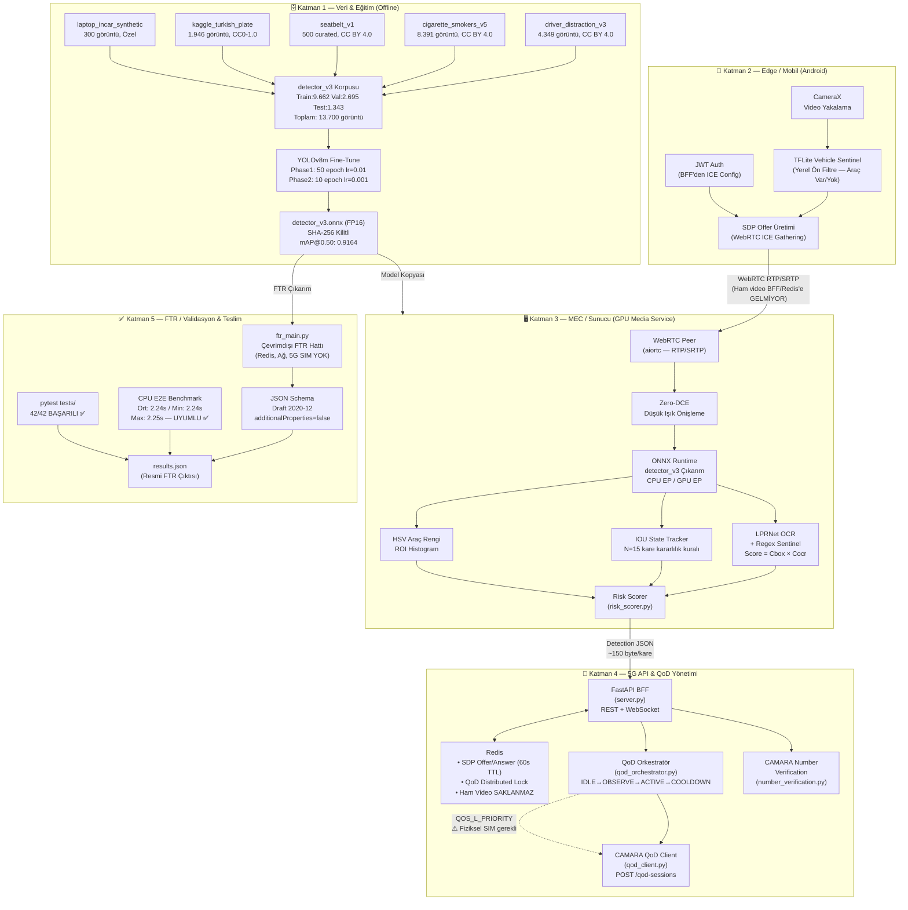
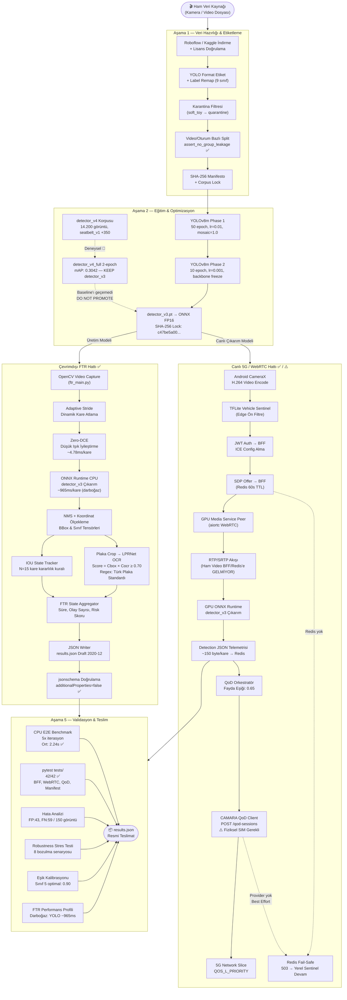
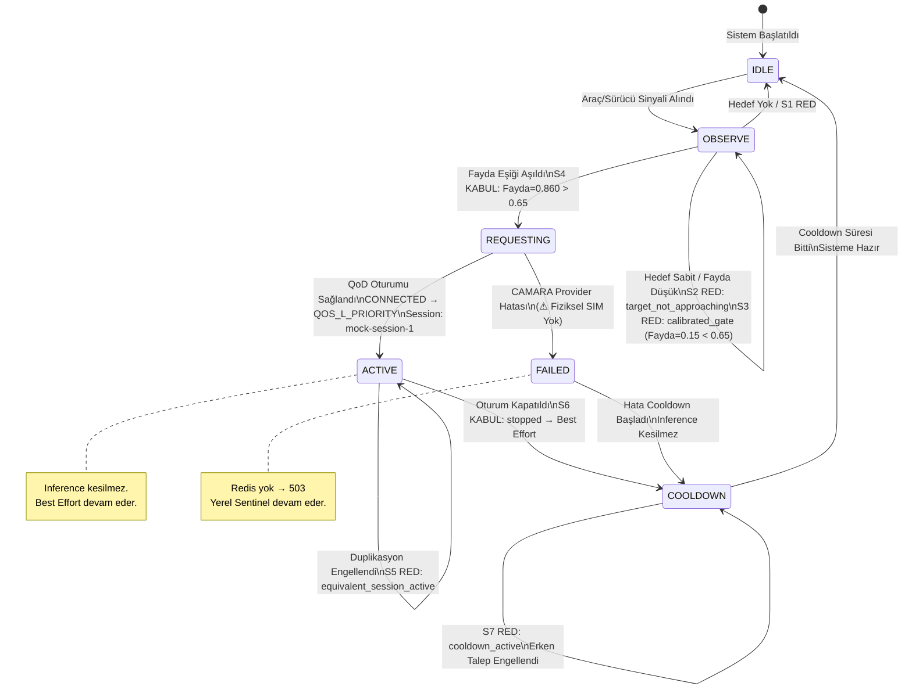

# SİNAPTİC5G — Proje Mermaid Diyagramları (Teknik Kanıt Paketi)

> **Proje:** SİNAPTİC5G  
> **Tarih:** 2026-06-22  
> **Kaynak doğrulaması:** `ARCHITECTURE.md`, `ftr_main.py`, `media_service.py`, `server.py`, `api/qod_client.py`, `api/qod_orchestrator.py`, `api/vehicle_sentinel.py`, `api/webrtc_signaling.py`, `reports/qod_decision_simulation.md`, `reports/ftr_performance_profile.md`  
> **Kanıt disiplini:** ÖLÇÜLDÜ / TAMAMLANDI / ⚠️ UYARI / 🎯 HEDEF  

---

## DİYAGRAM 1 — Genel Yol Haritası ve Proje Aşamaları

### Açıklama
Projenin 5 ana aşamasını ve bu aşamalar arasındaki girdi/çıktı ilişkisini gösterir. Proje yaşam döngüsünü soldan sağa takip eden bu diyagram, **sunum açılış slaytı** olarak kullanılabilir; jüriye "projemizin hangi aşamada ne yaptık" sorusunu tek bakışta yanıtlar.

```mermaid
flowchart LR
    subgraph A1["Aşama 1 — Veri Hazırlığı & Kalibrasyon ✅"]
        A1a["Açık Kaynak Veri Setleri\n(Roboflow, Kaggle)"]
        A1b["Kanonik Sınıf Sözlüğü\n(9 Sınıf, ID 0–8)"]
        A1c["Video/Oturum Bazlı Split\n+ Sızıntı Kontrolü"]
        A1d["Karantina & Lisans Denetimi\n(CC BY 4.0 / CC0)"]
        A1a --> A1b --> A1c --> A1d
    end

    subgraph A2["Aşama 2 — YZ Modeli Geliştirme & Optimizasyon ✅"]
        A2a["YOLOv8m Fine-Tuning\n(Phase 1: 50 epoch, Phase 2: 10 epoch)"]
        A2b["detector_v3 — Üretim Modeli\nmAP@0.50: 0.9164"]
        A2c["ONNX FP16 Export\n+ SHA-256 Model Lock"]
        A2d["detector_v4 Korpusu\n(14.200 görüntü — Deneysel 🎯)"]
        A2a --> A2b --> A2c
        A2d -. "Deneysel: 2-epoch, mAP: 0.3042" .-> A2b
    end

    subgraph A3["Aşama 3 — 5G API Entegrasyonu & QoD Yönetimi ✅ / ⚠️"]
        A3a["CAMARA QoD API İstemcisi\n(qod_client.py)"]
        A3b["QoD Orkestratör\n(qod_orchestrator.py)"]
        A3c["Durum Makinesi\nIDLE→OBSERVE→ACTIVE→COOLDOWN"]
        A3d["Gerçek CAMARA Testi\n⚠️ UYARI: 5G SIM & Sandbox Gerekli"]
        A3a --> A3b --> A3c -. "Fiziksel SIM yok" .-> A3d
    end

    subgraph A4["Aşama 4 — Edge & MEC Katmanları"]
        subgraph A41["4.1 Edge (Mobil) ✅"]
            A41a["Android CameraX\nVideo Capture"]
            A41b["TFLite Vehicle Sentinel\n(Yerel Ön Filtre)"]
            A41c["WebRTC P2P Yayın\n(aiortc / RTP-SRTP)"]
            A41a --> A41b --> A41c
        end
        subgraph A42["4.2 MEC (Sunucu) ✅"]
            A42a["GPU Media Service\n(media_service.py)"]
            A42b["ONNX Runtime Çıkarım\ndetector_v3 — CPU/GPU EP"]
            A42c["BFF: FastAPI server.py\nRedis Signaling & QoD Lock"]
            A41c -->|"WebRTC RTP/SRTP"| A42a --> A42b --> A42c
        end
    end

    subgraph A5["Aşama 5 — Entegrasyon, Validasyon & Teslim ✅"]
        A5a["Offline FTR Hattı\n(ftr_main.py)"]
        A5b["JSON Schema Doğrulama\n(Draft 2020-12, additionalProperties=false)"]
        A5c["CPU E2E Benchmark\nOrt: 2.24s ≤ 8s ✅"]
        A5d["Pytest 42/42 ✅"]
        A5e["results.json\n(Resmi Teslimat Çıktısı)"]
        A5a --> A5b --> A5e
        A5c --> A5e
        A5d --> A5e
    end

    A1d --> A2a
    A2c --> A5a
    A2c --> A42b
    A3c --> A42c
    A42c --> A5a
```

**Sunumda nasıl kullanılır:** Proje kapsamı bölümünün (1. bölüm) ilk slaytı. "Projemiz kaç aşamadan oluşuyor, her aşamanın çıktısı ne?" sorusuna görsel yanıt verir.

---

## DİYAGRAM 2 — Katmanlı Sistem Mimarisi

### Açıklama
Sistemi 5 mimari katmana ayırarak her katmanın bileşenlerini ve katmanlar arası veri/kontrol akışını gösterir. **Jüriye mimari genel bakış** için kullanılabilir; özellikle "Offline FTR ve Live 5G nasıl ayrışıyor?" sorusunun görsel yanıtıdır.

**Sunumda nasıl kullanılır:** Çözüm mimarisi bölümünün (3.2) ana slaytı. Her katmanı ayrı ayrı göstererek "hangi bileşen nerede çalışıyor?" sorusunu yanıtlar.

---

## DİYAGRAM 3 — Uçtan Uca Veri Akışı (Offline FTR + Live 5G Dalları)

### Açıklama
Ham verinin kaynaktan final `results.json` çıktısına kadar geçtiği her adımı gösterir. Offline FTR ve Live 5G kolları ayrı dallar olarak çizilmiştir. **Teknik sınama bölümünde** (4. bölüm) "sistemi nasıl test ettiniz?" sorusuna görsel yanıt verir.

**Sunumda nasıl kullanılır:** Çözümün sınanması bölümünün (4. bölüm) açılış slaytı. "Veri nereden geliyor, model nasıl çıkarım yapıyor, sonuç nasıl üretiliyor?" sorularını tek akışta yanıtlar.

---

## DİYAGRAM 4 — Entegrasyon, Bileşen Statüsü ve Final Üretim Kararı

### Açıklama
Tüm bileşenleri **üretimde aktif / deneysel / açık hedef** statülerine göre ayıran karar diyagramı. **Jüri ve danışmana "hangi bileşen hazır, hangisi neden hazır değil?" sorusunun dürüst ve şeffaf yanıtıdır.** Teknik sınama bölümünün kapanış slaytı olarak kullanılabilir.

```mermaid
flowchart TB
    subgraph PROD["🟢 ÜRETİMDE AKTİF — TAMAMLANDI / ÖLÇÜLDÜ"]
        direction LR
        P_MODEL["detector_v3.onnx\nmAP@0.50: 0.9164\nPrecision: 0.9225 / Recall: 0.8905"]
        P_FTR["ftr_main.py\nOffline FTR Hattı\nJSON Schema ✅"]
        P_BENCH["CPU E2E: 2.24s\nHedef ≤8s — UYUMLU ✅"]
        P_PYTEST["pytest 42/42 ✅"]
        P_SCHEMA["results.json\nDraft 2020-12 Şema Onaylı ✅"]
        P_REDIS["Redis Signaling\nSDP TTL 60s / Atomic Offer-Answer ✅"]
        P_WEBRTC["WebRTC P2P\nRTP/SRTP Ham Video Zero-Storage ✅"]
        P_QOD_SIM["QoD Durum Makinesi Simülasyonu\n7 Senaryo Doğrulandı ✅"]
        P_TRACKER["IOU State Tracker\nN=15 Kare Kararlılık ✅"]
        P_OCR_PIPE["OCR Pipeline (LPRNet)\nLatency Ölçüldü ✅"]
        P_HSV["HSV Araç Rengi\nROI Histogram ✅"]
        P_ZDCE["Zero-DCE Önişleme\nOrtalama 4.78ms ✅"]
        P_HASHLOCK["Model Hash Lock\nSHA-256 Doğrulama ✅"]
    end

    subgraph EXP["🟡 DENEYSEL — TAMAMLANDI, ÜRETİME ALINMADI"]
        E_V4CORP["detector_v4 Korpusu\n14.200 görüntü, seatbelt_v1 +350\nSHA-256 Kilitli ✅"]
        E_V4FULL["detector_v4_full\n2-epoch, mAP@0.50: 0.3042\nKısıtlı GPU — KEEP detector_v3"]
        E_V4SMOKE["detector_v4_smoke\n1-epoch %5 fraksiyon\nPipeline Doğrulama Amaçlı"]
        E_ERR["Hata Analizi Galerisi\nFP/FN Dağılımı ✅"]
        E_ROB["Robustness Stres Testi\n8 Bozulma Senaryosu ✅"]
        E_THRESH["Eşik Kalibrasyonu\nSınıf 5 optimal: 0.90 ✅"]
        E_PROFILE["FTR Performans Profili\nBileşen Bazlı ms ✅"]
    end

    subgraph WARN["🔴 AÇIK HEDEF / UYARI — DIŞ BAĞIMLILIK"]
        W_TEKNOCAN["Teknocan Sentetik Veri\n⚠️ Ön Plan PNG Eksik\nScript hazır: generate_teknocan_synthetic.py"]
        W_OCR_ACC["OCR CER & Exact-Match\n🎯 HEDEF: Ground-truth Plaka Seti Yok\nDeğerlendirme kiti hazır"]
        W_CAMARA["Gerçek Turkcell CAMARA Testi\n⚠️ Fiziksel 5G SIM + Sandbox Gerekli\nSimülasyon doğrulandı"]
        W_V4FULL["detector_v4 Tam Eğitim\n🎯 HEDEF: 50-epoch GPU Ortamı Gerekli\nKorpus hazır"]
        W_T4["CUDA/T4 Benchmark\n🎯 HEDEF: GPU Ortamı Gerekli\nCPU uyumlu, T4 beklenen"]
    end

    subgraph DECISION["⚖️ Final Model Kararı"]
        DEC["KEEP detector_v3\nmAP@0.50: 0.9164\nDetector_v4 → DO NOT PROMOTE"]
    end

    P_MODEL --> DECISION
    E_V4FULL -. "Baseline'ı geçemedi" .-> DECISION
    DECISION --> P_FTR
    DECISION --> P_WEBRTC

    PROD --> FINAL_OUTPUT(["📦 Teslim Paketi\nresults.json + pytest 42/42\n+ CPU 2.24s + SHA-256 Kilitli Model"])
    EXP --> EVIDENCE(["📊 Kanıt Paketi\n73 rapor dosyası\nFINAL_EVIDENCE_INDEX.md"])
    WARN --> ROADMAP(["🗺️ Gelecek Çalışmalar\nHEDEF/UYARI Raporu\nfinal_quality_gate.md"])
```

**Sunumda nasıl kullanılır:** Projenin kapanış slaytı. "Projede ne hazır, ne deneysel, ne eksik?" sorusunu renk koduyla (yeşil/sarı/kırmızı) şeffaf biçimde yanıtlar; jürinin dürüstlük değerlendirmesini güçlendirir.

---

## EK — QoD Durum Makinesi Diyagramı (Doğrulama Kanıtı)

### Açıklama
`reports/qod_decision_simulation.md` dosyasındaki 7 simülasyon senaryosundan üretilmiştir. **Canlı 5G entegrasyon bölümünde** doğrulama kanıtı olarak sunulabilir.

**Sunumda nasıl kullanılır:** "5G CAMARA testini gerçek ortamda yapmadınız, sistemi nasıl doğruladınız?" sorusuna yanıt. 7 simülasyon senaryosunun her birinin bu diyagramda hangi geçişe karşılık geldiği gösterilebilir.

---

*Bu belge SİNAPTİC5G projesinin jüri sunumu için hazırlanmıştır.*  
*Telif Hakkı (c) 2026 Seydi Eryılmaz (@seydivakkas) — Tüm Hakları Saklıdır.*
