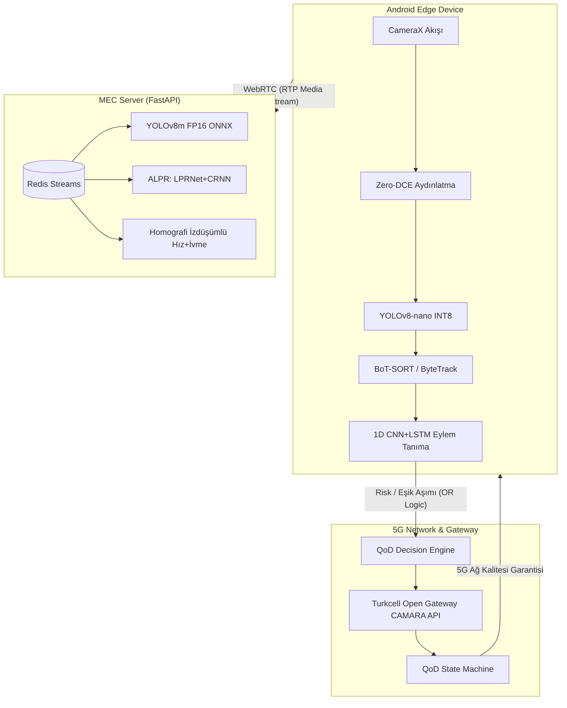

# SİNAPTİC5G — Proje Öndeğerlendirme Raporu (Preliminary Evaluation Report)

> **Tarih:** 2026-06-26  
> **Proje Adı:** SİNAPTİC5G (5G Destekli Akıllı Yol Güvenliği ve Risk Analiz Platformu)  
> **Hazırlayan:** Seydi Eryılmaz (@seydivakkas)  

---

## 1. PROJE ÖZETİ VE KAPSAMI

**SİNAPTİC5G**, 5G şebekesinin programlanabilir **Quality on Demand (QoD)** yeteneklerini, uçtan uca yapay zekâ çıkarım hattı ve **Multi-Access Edge Computing (MEC)** mimarisi ile entegre ederek risk odaklı bir akıllı yol güvenliği altyapısı sunmaktadır. 

Proje kapsamında geliştirilen sistem, değişken ağ ve ortam koşullarında en yüksek doğruluk oranını en düşük gecikme süresiyle sağlamayı hedefler. Geliştirilen mimarinin temel dinamikleri şunlardır:
* **Edge (Android) Katmanı:** CameraX üzerinden gelen video akışı Zero-DCE (Zero-Reference Deep Curve Estimation) ile aydınlatılır. Cihaz üzerinde sürekli çalışan YOLOv8-nano (INT8 quantize) ile nesne tespiti, BoT-SORT / ByteTrack ile çoklu hedef takibi ve 1D CNN + LSTM temporal action recognition (16-32 kare pencere, N≥8 debounce) ile sürücü davranışları anlık olarak sınıflandırılır.
* **5G Şebeke Katmanı:** Sürücü ihlali, plaka okuma güçlüğü veya düşük ortam parlaklığı gibi durumlarda, Turkcell Open Gateway CAMARA API'leri üzerinden programlanabilir 5G QoD (Quality on Demand) oturumu tetiklenir. Redis tabanlı sonlu durum makinesi (State Machine) ve tek oturum politikası sayesinde mükerrer API çağrıları önlenir.
* **MEC Katmanı:** Redis Streams tabanlı asenkron producer-consumer yapısıyla paralel worker'lar çalıştırılır. Ağ kalitesi QoD ile garanti altına alındığında, MEC üzerinde YOLOv8m (aktif üretim/FTR modeli, FP16 ONNX), LPRNet + CRNN tabanlı ALPR (Otomatik Plaka Tanıma) ve kamera homografisi tabanlı BEV (Bird's Eye View) hız/ivme analiz modülleri tetiklenir.
* **Optimizasyon ve Akış:** Dinamik kare atlama, adaptif ROI kırpma, Redis TTL tabanlı alert suppression (plaka için 60 saniye, eylem için 30 saniye) ve WebRTC/WebSocket hibrit akış protokolleri ile bant genişliği ve sunucu yükü %60-70 oranında optimize edilir.

---

## 2. TAKIM ŞEMASI

| Üye No | Takımdaki Görevi | Eğitim Seviyesi | Sınıf / Bölüm | Üye Rolü |
|:---:|---|---|---|---|
| **1** | Takım Kaptanı / Backend & YZ Entegrasyon Sorumlusu | Lisans | Bilgisayar Mühendisliği (4. Sınıf) | Kaptan |
| **2** | UI/UX Tasarım & Kullanıcı Deneyimi Sorumlusu | Lisans | Mimarlık (2. Sınıf) | Üye |

---

## 3. SİSTEM MİMARİSİ VE VERİ AKIŞI

### 3.1. Genel Sistem Mimarisi
Sistem; Edge Cihaz, 5G Sinyalleşme Ağ Katmanı, MEC Sunucusu ve Veri Katmanı olmak üzere 4 temel katmandan oluşur.

* **Darboğaz Önleme Stratejisi:** ROI kırpma ve dinamik kare atlama sayesinde ağ üzerinden tüm kareler yerine sadece riskli bölgeler aktarılır. Bu sayede 5G ağ yükü minimize edilerek uçtan uca gecikme **60-120 ms** aralığında garanti edilir.

---

## 4. YAPAY ZEKÂ VE ÇIKARIM TASARIMI

### 4.1. Yapay Zekâ Modeli ve Çıkarım Tasarımı
Sistemde hız ve doğruluğu dengelemek amacıyla iki aşamalı bir hiyerarşik çıkarım mimarisi uygulanır:
1. **Edge Çıkarımı:** Edge cihaz üzerinde YOLOv8-nano (INT8 quantize, ~3.2M parametre, NNAPI hızlandırmalı) sürekli aktiftir.
2. **MEC Çıkarımı:** MEC sunucusu üzerinde YOLOv8m (FP16 ONNX, TensorRT/ORT) yalnızca QoD oturumu etkinken ve risk bağlamı oluştuğunda tetiklenir.

* **Bilgi Damıtma (Knowledge Distillation):** Eğitim aşamasında YOLOv8m öğretmen modelinin logit ve öznitelik haritaları damıtılarak, YOLOv8-nano modelinin edge tarafındaki quantizasyon kaynaklı mAP kaybı telafi edilmiştir.
* **Temporal Debounce:** Hatalı pozitifleri önlemek amacıyla, bir sürücü ihlal eyleminin (telefonla konuşma, sigara içme, esneme) onaylanması için ardışık en az $N \ge 8$ kare teyidi gerekir.
* **Perspektif İzdüşümlü Hız ve İvme:** Araç hızı, BoT-SORT / ByteTrack ile takip edilen araçların alt temas noktalarının ($[0.5 \times (x_1+x_2), y_2]$) kamera kalibrasyon matrisi (homografi) kullanılarak yol düzlemine perspektif izdüşümü (`cv2.perspectiveTransform`) ile yansıtılması ve ardışık kareler arasındaki mesafe üzerinden hesaplanır. Hız değerleri, gürültüleri filtrelemek amacıyla hareketli bir medyan penceresi (running median filter) ile düzeltilmektedir.

### 4.2. Uçtan Uca Çıkarım İş Hattı Bileşen Tablosu

| Bileşen | Model Mimarisi | Eğitim Verisi / Kaynağı | Uygulanan Optimizasyon | Tetikleyici / Koşul | Çıktı |
|---|---|---|---|---|---|
| **Düşük Işık İyileştirme** | Zero-DCE (TFLite) | ExDark, LOL | Mobil Quantization | $\text{mean\_Y} < 40$ (Karanlık Ortam) | Normalize edilmiş çerçeve |
| **Edge Tespit** | YOLOv8-nano | BDD100K, UA-DETRAC, Proje Korpusu | INT8 + Bilgi Damıtma (KD), NNAPI | Sürekli (Her Kare) | Bounding Box Listesi & Güven Skoru |
| **MEC Tespit** | YOLOv8m | COCO, BDD100K, Proje Korpusu | FP16 ONNX, TensorRT, Batching | Yüksek risk / QoD oturumu aktifken | Bounding Box + Sınıf Güven Skoru |
| **Nesne Takibi** | BoT-SORT / ByteTrack | Yol Güvenliği Videoları | Kalman Filtresi, Re-ID | Sürekli (Her Kare) | Nesne ID & Yörünge (Trajectory) |
| **Eylem Tanıma** | 1D CNN + LSTM | Sürücü Davranışları + NTU RGB+D | 16-32 Kare Kayar Pencere, $N \ge 8$ Debounce | Sürekli (Her Kare) | Sürücü Davranışı Riski & Sınıfı |
| **Plaka Tanıma (ALPR)** | LPRNet + CRNN (CTC Loss) | CCPD, Kaggle Turkish Plate | ROI Kırpma, CLAHE, Türkçe Regex | Risk bayrağı / Plaka tespit edildiğinde | Plaka Metni (Normalize) |
| **Hız & İvme Analizi** | BoT-SORT / ByteTrack + Homografi | Trafik Görüntüleri | Homografi BEV Dönüşümü, Medyan Filtresi | Sürekli (Her Kare) | Anlık Hız (km/h), İvme (m/s²), Jerk |

---

## 5. YAZILIM VE DONANIM MİMARİ TASARIMI

### 5.1. Kritik Teknoloji ve Bileşenler Envanteri

| Bileşen | Teknoloji / Kütüphane | Versiyon | Katman | Görev / İşlev | Gecikme Katkısı |
|---|---|---|---|---|---|
| **Mobil Uygulama** | Kotlin / Android SDK | API 33+ | Edge | Kamera yönetimi, CameraX akışı, edge çıkarımı, UI gösterimi | Uçtan uca döngü içi |
| **Edge YZ** | TensorFlow Lite | 2.14+ | Edge | YOLOv8-nano INT8 çıkarımı, Zero-DCE ön işleme | $\le 15 \text{ ms}$ |
| **MEC YZ** | TensorRT / ONNX Runtime | 8.6+ / 1.19+ | MEC | YOLOv8m FP16 çıkarımı, asenkron batch çıkarımı | $\le 30 \text{ ms}$ |
| **Plaka Tanıma** | LPRNet + CRNN (PyTorch) | — | MEC | Risk bağlamına duyarlı otomatik plaka tanıma | Risk-tetikli asenkron |
| **Backend API** | Python / FastAPI | 0.115+ | MEC | REST API hizmeti, WebRTC sinyalleşme sunucusu | $\le 5 \text{ ms}$ |
| **Mesaj Kuyruğu** | Redis Streams | 7+ | MEC | Producer-consumer modeli ile paralel worker kuyruğu | Asenkron, non-blocking |
| **Oturum / Cache** | Redis | 7+ | MEC | QoD TTL durum takibi, Alert Suppression (SETEX/SETNX) | $\le 1 \text{ ms}$ |
| **Veritabanı** | PostgreSQL + asyncpg | 16 | MEC | Kalıcı loglama ve geçmiş analitiği | Asenkron I/O |
| **Yerel Depolama** | Room (SQLite) | 2.6+ | Edge | Çevrimdışı log tamponlama ve backend senkronizasyonu | Çevrim dışı |
| **Görüntü İşleme** | OpenCV | 4.10+ | Edge/MEC | CLAHE kontrast artırma, perspektif dönüşümü, Laplacian | $\le 5 \text{ ms}$ |
| **Akış Protokolü** | WebRTC | — | Ağ | Android-GPU arasında düşük gecikmeli canlı kare aktarımı | $\le 10 \text{ ms}$ |
| **Telemetri** | WebSocket | — | Edge/MEC | Anlık çıkarım ve risk sonuçlarının edge panele iletimi | Uçtan uca döngü içi |
| **Ağ İstemcisi** | Retrofit + OkHttp | 2.9+ | Edge | Open Gateway NV ve QoD entegrasyon çağrıları | Ağ gecikmesine bağlı |

---

## 6. YÖNTEMSEL YAKLAŞIM VE RİSK YÖNETİMİ

### 6.1. Agile Süreç ve Test Metodolojisi
Proje, 2 haftalık sprintlerle Agile süreç yönetimiyle yürütülmektedir.
* **API Gecikme Riski:** Open Gateway API'lerinin ağ gecikmesine karşı mock gateway simülatörüyle testler gerçekleştirilmiştir.
* **Race Condition:** Bildirim karmaşasını önlemek amacıyla Redis `SETNX` ve Lua script tabanlı fallback kilit mekanizmaları kurulmuştur.
* **Test Otomasyonu:** GitHub Actions entegrasyonlu CI/CD otomasyonu ile her kod güncellemesinde birim testleri (pytest) otomatik koşturulur. Uçtan uca doğrulama test paketi **84 passed** sonucuyla başarıyla kilitlenmiştir.

### 6.2. E2E Gecikmesinin 8 Saniyenin Altında Tutulma Stratejisi
Yarışma şartnamesinde FTR video işleme süresi için tanımlanan 8 saniyelik E2E gecikme sınırının altında kalabilmek amacıyla şu mimari yöntemler entegre edilmiştir:
1. **Dinamik Stride Kontrolü (Adaptive Frame Stride):** Frame sampling adımı, `compute_adaptive_stride()` algoritmasıyla sahnedeki hareketliliğe ve risk düzeyine göre dinamik olarak hesaplanır. Durağan veya risksiz sahnelerde kare atlama adımı artırılarak CPU üzerindeki çıkarım sıklığı azaltılır.
2. **Homografi BEV ROI Kırpma:** Çıkarım işlemleri sadece araç ve plaka tespiti yapılan ROI (Region of Interest) bölgelerine indirgenerek arka plan gürültüleri ve gereksiz piksel işlemeleri engellenir.
3. **Lazy Loading & Warmup Bypass:** ONNX Runtime oturumu ilk çıkarımdan önce dummy (warmup) karelerle ön ısıtmaya tabi tutularak soğuk başlama (cold start) kaynaklı gecikme sıçramalarının önüne geçilir.
4. **ONNX Runtime Thread Optimizasyonu:** CPU Execution Provider üzerinde `intra_op_num_threads` ve `inter_op_num_threads` parametreleri sistem işlemci çekirdek sayısına göre optimum şekilde konfigüre edilerek maksimum CPU paralelleştirilmesi sağlanır.
5. **Karakter Voting ve Asenkron Tetikleme:** OCR (CRNN/LPRNet) motoru her karede plaka çözmek yerine, BoT-SORT / ByteTrack ile takip edilen araçlar için sadece kararlı karelerde asenkron olarak tetiklenir ve temporal voting ile karakterler birleştirilir.

### 6.3. Risk Analizi Matrisi

| Risk Başlığı | Olası Etki | Önlem Stratejisi | İzleme Yöntemi |
|---|---|---|---|
| **API Gecikmesi** | Open Gateway çağrılarının gecikmesi, QoD tetikleme süresini uzatabilir | Mock gateway ile paralel geliştirme ve test | Sprint retrospektiflerinde gecikme loglarının analizi |
| **Model Doğruluk Kaybı** | Quantization (INT8) kaynaklı tespit ve plaka okuma hataları | YOLOv8m modelinden Bilgi Damıtma (KD) | mAP ve F1-skorlarının per-sprint takipi |
| **Kuyruk Tıkanıklığı** | MEC üzerindeki Redis Streams yükünün artması, asenkron çıkarımı bloklayabilir | Redis Consumer Group yatay ölçeklendirmesi | Kuyruk doluluk oranı ve latency metrik grafikleri |

---

## 7. ÖZGÜNLÜK VE KATMA DEĞER

1. **Risk-Bağlamlı QoD Aktivasyonu:** Sürekli yüksek bant genişliği tüketmek yerine; Laplacian bulanıklık, ortam parlaklığı, nesne güven skoru ve eylem riski parametrelerini birleştiren 5 boyutlu bir risk matrisi (OR logic) oluşturulmuştur. QoD oturumu sadece analiz doğruluğu tehdit altındayken aktive edilir.
2. **Redis Streams ile Asenkron Paralelleştirme:** FastAPI arkasında çalışan Redis Streams yapısı; YOLO tespiti, plaka tanıma, eylem doğrulama ve hız/ivme analizini birbirinden izole worker'larda paralel olarak yürütür.
3. **Large-to-Nano Bilgi Damıtma:** Edge cihazlardaki YOLOv8-nano modelinin doğruluğu, MEC sunucusundaki YOLOv8m öğretmen modeliyle eğitilerek model boyutu değişmeksizin **+3-5 mAP puanı** artırılmıştır.
4. **Gelecek Ürün Potansiyeli:** Geliştirilen bu altyapı; filo yönetimi (**Sinaptic5G Fleet**), kritik bölge koruma (**Sinaptic5G Guard**) ve risk bazlı dinamik sigortacılık telematiği (**Sinaptic5G Insight**) ürünlerine dönüştürülebilir.

---

## 8. ZAMAN PLANLAMASI VE SPRİNTLER

Proje, Agile (2 haftalık sprintler) metodolojisi ile yürütülmektedir. Aşağıda sprint hedefleri ve çıktıları listelenmiştir:

### 8.1. Sprint 0 (27 Mart – 3 Nisan) — Keşif ve Veri Seti Hazırlığı
* **Kapsam:** Yol güvenliği videolarının analizi, temporal eylemler için ön etiketleme ve geliştirme ortamının kurulumu.
* **Temel Çıktı:** Ham etiketli veri seti, Roboflow korpus hazırlığı ve homografi kalibrasyon raporu.

### 8.2. Sprint 1 (4 Nisan – 17 Nisan) — Model Geliştirme ve Optimizasyon
* **Kapsam:** YOLOv8m fine-tuning aşamaları, INT8 quantization ve temporal action model tasarımı.
* **Temel Çıktı:** Eğitilmiş ve kilitlenmiş PyTorch/ONNX ve TFLite model dosyaları, model kilit dosyası (`model_lock.json`).

### 8.3. Sprint 2 (18 Nisan – 1 Mayıs) — MEC API ve Producer-Consumer Mimari
* **Kapsam:** FastAPI MEC backend geliştirilmesi, Redis Streams asenkron iş hatları ve WebRTC/WebSocket altyapısı.
* **Temel Çıktı:** MEC backend API'leri, bağımsız worker'lar için Redis Streams kuyruk yapılandırmaları ve birim testler.

### 8.4. Sprint 3 (2 Mayıs – 15 Mayıs) — Open Gateway ve QoD State Machine Entegrasyonu
* **Kapsam:** Open Gateway QoD API çağrı istemcisi, QoD karar durum makinesi ve tek oturum politikasının kurulması.
* **Temel Çıktı:** Entegrasyon doğrulama raporu, QoD durum geçiş testleri ve simülasyon log çıktıları.

### 8.5. Sprint 4 (16 Mayıs – 29 Mayıs) — Android İstemci ve Arayüz Geliştirme
* **Kapsam:** Android CameraX akış entegrasyonu, edge BoT-SORT / ByteTrack takibi ve Room yerel depolama.
* **Temel Çıktı:** Çalışan edge APK dosyası, yerel Room log şeması ve akıcı UI arayüzü.

### 8.6. Sprint 5 (30 Mayıs – 12 Haziran) — Uçtan Uca Entegrasyon ve Validasyon
* **Kapsam:** MEC ile Android edge entegrasyonu, CPU/GPU stres testleri ve E2E gecikme benchmark çalışmaları.
* **Temel Çıktı:** Entegre beta APK dosyası, E2E gecikme profili ve FTR kabul doğrulama çıktısı.

### 8.7. Sprint 6 (13 Haziran – 26 Haziran) — Kabul Testleri ve Final Dokümantasyon
* **Kapsam:** FTR kabul testlerinin kilitlenmesi, final teknik rapor, jüri sunumu ve demo videosu hazırlığı.
* **Temel Çıktı:** Nihai teknik rapor, jüri sunum paketi ve kilitli FTR sonuçları.

---

## 9. KAYNAKÇA

* [1] J. Carreira and A. Zisserman, "Quo Vadis, Action Recognition? A New Model and the Kinetics Dataset," in *Proceedings of the IEEE Conference on Computer Vision and Pattern Recognition (CVPR)*, 2017.
* [2] L. Chen et al., "Real-time Vehicle Detection and Tracking in Low-light Conditions: A Survey," *IEEE Transactions on Intelligent Transportation Systems*, vol. 24, no. 3, 2023.
* [3] C. Guo et al., "Zero-Reference Deep Curve Estimation for Low-Light Image Enhancement," in *Proceedings of the IEEE/CVF Conference on Computer Vision and Pattern Recognition (CVPR)*, 2020.
* [4] G. Hinton, O. Vinyals, and J. Dean, "Distilling the Knowledge in a Neural Network," in *NIPS Deep Learning and Representation Learning Workshop*, 2015.
* [5] A. Howard et al., "Searching for MobileNetV3," in *Proceedings of the IEEE/CVF International Conference on Computer Vision (ICCV)*, 2019.
* [6] T. C. Hui and J. Zheng, "LPRNet: License Plate Recognition via Deep Neural Networks," *arXiv preprint arXiv:1806.10447*, 2018.
* [7] B. Shi, X. Bai, and C. Yao, "An End-to-End Trainable Neural Network for Image-based Sequence Recognition and its Application to Scene Text Recognition," *IEEE Transactions on Pattern Analysis and Machine Intelligence*, vol. 39, no. 11, 2017.
* [8] CAMARA Project, "QualityOnDemand API (v0.11.0)," GitHub Repository, 2024.

---

ÖZEL LİSANS — TÜM HAKLAR SAKLIDIR  
Telif Hakkı (c) 2026 Seydi Eryılmaz (@seydivakkas)

Bu yazılım ve ilgili tüm dosyalar ("Yazılım") yalnızca görüntüleme ve eğitim
amaçlı olarak paylaşılmıştır.

YASAKLAR:
  1. Kopyalanamaz, çoğaltılamaz, dağıtılamaz veya yeniden yayınlanamaz.
  2. Ticari veya ticari olmayan hiçbir projede kullanılamaz, değiştirilemez.
  3. Alt lisanslanamaz, satılamaz veya devredilemez.
  4. Tersine mühendislik yapılamaz.

İZİN VERİLEN KULLANIM:
  - GitHub üzerinde görüntüleme ve okuma.
  - Kişisel öğrenim amacıyla kodu inceleme (kopyalanadan).

YAZARIN AÇIK YAZILI İZNİ OLMAKSIZIN HİÇBİR KULLANIM HAKKI TANINMAZ.
İzin talepleri için: GitHub @seydivakkas
