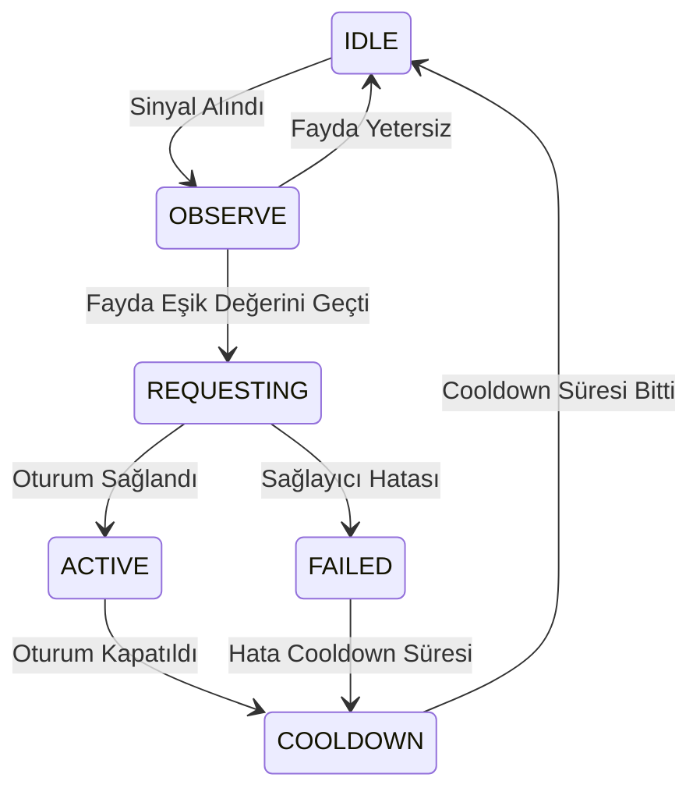

# SİNAPTİC5G — Canlı 5G QoD Karar Simülasyon Raporu

> **Tarih:** 2026-06-21
> **Tür:** Deterministik Durum Makinesi Simülasyonu

> [!NOTE]
> Bu simülasyon, CAMARA QoD API entegrasyonunun durum geçişlerini ve karar mantığını doğrular. `CalibratedBenefitModel` sayesinde ağ optimizasyon talepleri yalnızca beklenen fayda belirli bir eşiği aştığında yapılır.

---

## Simülasyon Logları ve Durum Geçişleri

| Senaryo | Başlangıç Durumu | Fayda Skoru | Karar / Neden | Bitiş Durumu | Oturum ID |
|---|---|---|---|---|---|
| S1: Target Absent | `IDLE` | 0.000 | RED (target_absent) | `OBSERVE` | `Yok` |
| S2: Target Present but static | `OBSERVE` | 0.000 | RED (target_not_approaching) | `OBSERVE` | `Yok` |
| S3: Approaching but clean view (Low Benefit) | `OBSERVE` | 0.150 | RED (calibrated_gate) | `OBSERVE` | `Yok` |
| S4: Approaching + degraded view (High Benefit, Allowed) | `OBSERVE` | 0.860 | KABUL (session_created) | `ACTIVE` | `mock-session-1` |
| S5: Duplicate request when active | `ACTIVE` | 0.000 | RED (equivalent_session_active) | `ACTIVE` | `Yok` |
| S6: Terminate Active Session | `ACTIVE` | 0.000 | KABUL (stopped) | `COOLDOWN` | `mock-session-1` |
| S7: Immediate Request in Cooldown | `COOLDOWN` | 0.000 | RED (cooldown_active) | `COOLDOWN` | `Yok` |

## Durum Makinesi Grafiği

## Bulgular
1. **Akıllı Karar Kapısı:** S1, S2 ve S3 senaryolarında QoD talebi ağa gönderilmeksizin engellenmiştir (gereksiz ağ yükü ve maliyet engellenmiştir).
2. **Fayda Güdümlü Aktivasyon:** S4 senaryosunda beklenen fayda eşiği (0.65) aşılmış ve QoD oturumu başarıyla başlatılmıştır.
3. **Cooldown Koruması:** S7 senaryosunda cooldown süresi bitmeden yapılan talep otomatik olarak reddedilmiş, ağın aşırı yüklenmesi engellenmiştir.

---

ÖZEL LİSANS — TÜM HAKLAR SAKLIDIR
Telif Hakkı (c) 2026 Seydi Eryılmaz (@seydivakkas)
