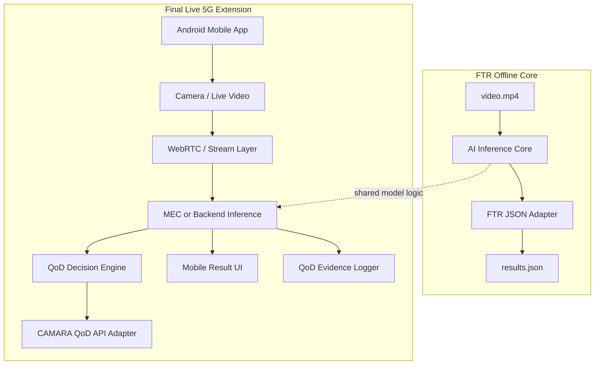

# SINAPTIC5G Project Skill

> **Kullanım amacı:** Bu dosya, Sinaptic5G projesiyle ilgili çalışan her AI agent, kod ajanı, rapor ajanı, mimari ajanı veya test ajanı için tekil referans belgedir.  
> **Temel görev:** Her yeni işlemde geçmiş konuşmaları tekrar tekrar tüketmek yerine önce bu belgeyi oku, proje bağlamını buradan kur, sonra sadece eksik/güncel dosyaları incele.

---

## 0. Zorunlu İlk Talimat

Sinaptic5G projesinde çalışmaya başlamadan önce:

1. Önce bu dosyayı oku.
2. Sonra repo içindeki mevcut dosyaları incele.
3. FTR teslim dokümanı ile teknik şartname arasında karar çakışması varsa **FTR teslim dokümanını esas al**.
4. v3/v4 eski referans mimarilerdir; mevcut ana aday sistem **Sinaptic5G v5** olarak ele alınır.
5. v5 mimari, FTR teslim kontratını kanıtlı şekilde geçmeden production kabul edilmez.
6. FTR core içine final/mobil/5G bağımlılığı sokma.
7. JSON şemasını genişletme.
8. Etiketleri değiştirme.
9. Kanıt yoksa “kanıt yok” yaz; varsayım yapma.

---

## 1. Projenin Ana Tanımı

**Sinaptic5G v5**, önce **FTR teslim kontratını hatasız geçen offline Docker tabanlı yapay zekâ çıkarım sistemi**, sonra **final yarışma/mobil 5G senaryosuna genişleyen canlı video + Quality on Demand + mobil uygulama sistemi** olarak tasarlanmıştır.

Bu projeyi şu iki katmanlı sistem olarak düşün:

| Katman | Amaç | Öncelik | Not |
|---|---|---:|---|
| **FTR Offline Docker Core** | Tek video dosyasını analiz eder ve hakem scriptinin kabul edeceği `results.json` üretir. | 1 | FTR tesliminin ana konusu budur. |
| **Final Live 5G Extension** | Mobil uygulama, canlı video, Number Verification, QoD, MEC/backend ve canlı gösterim katmanlarını ekler. | 2 | FTR core üzerine sonradan genişler. |

Kısa karar cümlesi:

> **Önce FTR scriptini hatasız geç. Sonra final/mobil/5G vizyonunu genişlet.**

---

## 2. Belge Öncelik Sırası

Sinaptic5G içinde karar verirken belge önceliği şöyledir:

| Öncelik | Kaynak | Projedeki Rolü |
|---:|---|---|
| 1 | **FTR Teslim Dokümantasyonu** | JSON formatı, etiketler, Docker çalışma koşulları, input/output path, hakem kabul kontratı |
| 2 | **Teknik Şartname** | Yarışmanın genel amacı, final mobil uygulama beklentisi, 5G API, QoD, Number Verification, canlı video |
| 3 | Repo içi mevcut durum | Kod, model, Docker, Android, evidence, raporlar |
| 4 | Önceki konuşmalar / notlar | Yardımcı bağlam; fakat kanıt yerine geçmez |

### Karar Kuralı

Eğer FTR Teslim Dokümantasyonu ile Teknik Şartname arasında uygulama açısından çelişki varsa:

```text
FTR Teslim Dokümantasyonu > Teknik Şartname
```

Örnek:

| Durum | Yanlış Karar | Doğru Karar |
|---|---|---|
| Teknik şartnamede hız geçiyor, FTR JSON’da hız alanı yok | `hiz` alanı eklemek | FTR JSON’a ek alan koyma; hız bilgisini raporda/final extension’da ele al |
| Finalde mobil uygulama gerekiyor | FTR Docker’ın APK/API beklemesi | FTR offline çalışsın; mobil final modülüne kalsın |
| QoD finalde önemli | FTR output’a `qod_status` eklemek | QoD’yi final evidence içinde tut; FTR JSON’u bozma |

---

## 3. FTR Teslim Kontratı

FTR tesliminde sistemin görevi:

```text
/app/data/input/video.mp4  ->  Sinaptic5G v5 FTR Core  ->  /app/data/output/results.json
```

### 3.1 Sabit Path Kuralları

| Alan | Değer |
|---|---|
| Input video path | `/app/data/input/video.mp4` |
| Output JSON path | `/app/data/output/results.json` |
| Model path | `/app/models/` veya repo tasarımına göre container içinde sabit model dizini |
| Çalışma şekli | Docker container ayağa kalkınca otomatik çalışır |
| Manuel adım | Olmamalı |
| İnternet gereksinimi | Olmamalı |
| Mobil cihaz / SIM / API gereksinimi | Olmamalı |

### 3.2 Docker Kabul Kuralları

FTR Docker teslimi için:

- `Dockerfile` proje root seviyesinde olmalı.
- `docker build` başarılı olmalı.
- `docker run` sonrası ekstra manuel komut gerekmemeli.
- Program `CMD` veya `ENTRYPOINT` ile otomatik başlamalı.
- Runtime internet erişimine ihtiyaç duymamalı.
- Giriş videosunu `/app/data/input/video.mp4` yolundan okumalı.
- Çıktıyı `/app/data/output/results.json` yoluna yazmalı.
- Çalışma süresi 10 dakika sınırını aşmamalı.
- İmaj boyutu 8 GB sınırını aşmamalı.
- Tesla T4 / CUDA ortamına uyumlu olmalı.
- GPU yoksa kontrollü CPU fallback stratejisi varsa belgelenmeli.
- Hata durumlarında container çökmeden geçerli JSON üretebilmelidir.

### 3.3 Yasak / Riskli Davranışlar

FTR tesliminde şunlar risklidir:

- Hakem ortamını algılamak için hostname, IP, ortam değişkeni veya dosya varlığı kontrolü yapmak.
- Değerlendirme ortamına göre farklı çıktı üretmek.
- JSON şemasını genişletmek.
- Etiketleri değiştirmek.
- Türkçe karakterli etiket üretmek.
- Runtime sırasında internetten model indirmek.
- API, SIM, mobil cihaz veya canlı kamera beklemek.
- `results.json` yazmadan çıkmak.
- Hatalı video durumunda crash olmak.

---

## 4. FTR JSON Şema Kontratı

FTR output dosyası `results.json` olmalıdır ve şu temel yapıyı korumalıdır:

```json
{
  "video_id": "video.mp4",
  "arac_bilgisi": {
    "tip": "sedan",
    "plaka": "34ABC123",
    "renk": "beyaz",
    "confidence_score": 0.94
  },
  "tespitler": [
    {
      "zaman_saniye": 14.5,
      "kategori": "sofor_eylemi",
      "etiket": "telefonla_konusma",
      "confidence_score": 0.89
    }
  ]
}
```

### 4.1 Zorunlu Anahtarlar

| JSON Alanı | Tip | Açıklama |
|---|---|---|
| `video_id` | string | İşlenen video adı |
| `arac_bilgisi` | object | Araç tipi, plaka, renk ve ortak güven skoru |
| `arac_bilgisi.tip` | string | FTR araç tipi listesinden biri |
| `arac_bilgisi.plaka` | string | Normalize edilmiş Türkiye plakası |
| `arac_bilgisi.renk` | string | FTR renk listesinden biri |
| `arac_bilgisi.confidence_score` | float | 0.0-1.0 arası |
| `tespitler` | array | Zaman bazlı olay listesi |
| `tespitler[].zaman_saniye` | float | Tespitin saniye bilgisi |
| `tespitler[].kategori` | string | `sofor_eylemi`, `nesneler`, `yolcular` |
| `tespitler[].etiket` | string | Kategoriye uygun FTR etiketi |
| `tespitler[].confidence_score` | float | 0.0-1.0 arası |

### 4.2 Kritik Yanlışlar

Aşağıdaki alternatif alan adları FTR için hatalı kabul edilmelidir:

| Yanlış | Doğru |
|---|---|
| `score` | `confidence_score` |
| `conf` | `confidence_score` |
| `guven_skoru` | `confidence_score` |
| `time` | `zaman_saniye` |
| `timestamp` | `zaman_saniye` |
| `second` | `zaman_saniye` |
| `cat` | `kategori` |
| `category` | `kategori` |
| `label` | `etiket` |
| `plate` | `plaka` |
| `color` | `renk` |
| `vehicle_type` | `tip` |

### 4.3 Şema Dışı Alan Politikası

FTR çıktısında şu alanlar kullanılmamalıdır:

- `hiz`
- `speed`
- `qod_status`
- `network_quality`
- `device_id`
- `api_status`
- `frame_id`
- `bbox`
- `track_id`
- `debug`
- `raw_predictions`

Bu alanlar gerekiyorsa ayrı evidence dosyalarında veya final extension loglarında tutulmalıdır.

---

## 5. Label Contract

FTR etiketleri sabittir. Bu liste dışına çıkan sınıflar FTR riski olarak işaretlenmelidir.

### 5.1 Araç Tipi

| Geçerli Değer |
|---|
| `sedan` |
| `suv` |
| `hatchback` |
| `pickup` |
| `minibus` |
| `panelvan` |
| `kamyon` |

### 5.2 Araç Rengi

| Geçerli Değer |
|---|
| `beyaz` |
| `siyah` |
| `gri` |
| `kirmizi` |
| `mavi` |
| `sari` |
| `yesil` |
| `turuncu` |
| `kahverengi` |

### 5.3 Tespit Kategorileri

| Kategori | Açıklama |
|---|---|
| `sofor_eylemi` | Sürücü davranışı / dikkat dağınıklığı / ihlal |
| `nesneler` | Kabin içi veya yol üzeri hedef nesneler |
| `yolcular` | Araç içi yolcu konumları |

### 5.4 Sürücü Eylemi Etiketleri

| Geçerli Değer |
|---|
| `arkaya_bakma` |
| `esneme` |
| `sigara_icme` |
| `su_icme` |
| `telefonla_konusma` |
| `slalom` |
| `etrafa_bakinma` |
| `emniyet_kemeri_ihlali` |

### 5.5 Nesne Etiketleri

| Geçerli Değer |
|---|
| `teknocan` |
| `bilgisayar` |

### 5.6 Yolcu Etiketleri

| Geçerli Değer |
|---|
| `arka_koltuk_1` |
| `arka_koltuk_2` |
| `on_koltuk` |

### 5.7 ASCII ve Küçük Harf Kuralı

FTR etiketleri:

- Küçük harfli olmalı.
- ASCII-safe olmalı.
- Türkçe karakter içermemeli.
- Boşluk içermemeli.
- Tire yerine alt çizgi kullanılmalı.
- FTR’de tanımlandığı haliyle birebir eşleşmeli.

Yanlış/doğru örnekleri:

| Yanlış | Doğru |
|---|---|
| `şoför_eylemi` | `sofor_eylemi` |
| `kırmızı` | `kirmizi` |
| `sarı` | `sari` |
| `yeşil` | `yesil` |
| `telefonla konuşma` | `telefonla_konusma` |
| `Telefonla_Konusma` | `telefonla_konusma` |

---

## 6. v5 Mimari Çerçevesi

Sinaptic5G v5 iki ana modüle ayrılmalıdır:

```text
sinaptic5g/
├── ftr_core/
│   ├── video_reader
│   ├── frame_sampler
│   ├── preprocess
│   ├── inference
│   ├── ocr_plate
│   ├── vehicle_attribute
│   ├── event_detector
│   ├── temporal_aggregator
│   ├── competition_adapter
│   ├── schema_validator
│   └── result_writer
│
└── final_5g_extension/
    ├── android_app
    ├── number_verification
    ├── live_video_stream
    ├── mec_backend
    ├── qod_policy_engine
    ├── camara_qod_adapter
    ├── mobile_result_ui
    └── qod_evidence_logger
```

### 6.1 FTR Offline Docker Core

FTR core aşağıdaki bağımsız hattı izlemelidir:

```mermaid
flowchart LR
    A[/app/data/input/video.mp4] --> B[Video Reader]
    B --> C[Frame Sampler]
    C --> D[Preprocess]
    D --> E[AI Inference Core]
    E --> F[OCR / Plate Normalizer]
    E --> G[Vehicle Attribute Classifier]
    E --> H[Object / Action / Passenger Detector]
    F --> I[Temporal Aggregator]
    G --> I
    H --> I
    I --> J[Competition Adapter]
    J --> K[JSON Schema Validator]
    K --> L[/app/data/output/results.json]
```

Bu hat:

- Offline çalışmalı.
- Final 5G modüllerine import-level bağımlı olmamalı.
- Android dosyalarını gerektirmemeli.
- API key gerektirmemeli.
- Mobil uygulama gerektirmemeli.
- Tek komutla çalışmalı.

### 6.2 Final Live 5G Extension

Final extension şu mantıkla FTR core üzerine kurulmalıdır:



Final extension özellikleri:

- Android mobil uygulama.
- Canlı video akışı.
- Number Verification ile sessiz doğrulama.
- Quality on Demand ile kritik durumda ağ kalitesi talebi.
- QoD açık/kapalı başarım kıyaslaması.
- Mobil ekranda tespit gösterimi.
- Yarışma günü demo/sunum evidence üretimi.

---

## 7. Model Politikası

### 7.1 v5 Ana Adaydır

- v3/v4 eski referans olarak kabul edilmez.
- v5 yeni ana aday mimaridir.
- Ancak v5, FTR acceptance testlerinden geçmeden production teslim hattına alınmaz.

### 7.2 Production Kabul Kriterleri

Bir modelin FTR production olması için:

| Kriter | Zorunlu mu? |
|---|---:|
| Docker içinde çalışması | Evet |
| `/app/data/input/video.mp4` okuyabilmesi | Evet |
| `/app/data/output/results.json` yazması | Evet |
| FTR JSON şemasını geçmesi | Evet |
| Label contract geçmesi | Evet |
| 10 dakika altında çalışması | Evet |
| Model hash / lock kanıtı | Evet |
| GPU yoksa kontrollü davranması | Tercihen evet |
| Accuracy metriği | Evet, ama JSON/Docker uyumundan sonra değerlendirilir |

### 7.3 Deneysel Model Politikası

Deneysel model:

- Daha yüksek doğruluk vaat edebilir.
- Fakat Docker/JSON/etiket/süre kanıtı yoksa FTR’ye alınmaz.
- Şema bozuyorsa FTR’ye alınmaz.
- İmaj boyutunu veya runtime süresini bozuyorsa FTR’ye alınmaz.

---

## 8. Veri ve Kanıt Stratejisi

FTR teslimi ve final için kanıt dosyaları ayrı tutulmalıdır.

### 8.1 FTR Evidence

Önerilen dosyalar:

| Dosya | Amaç |
|---|---|
| `evidence/ftr_acceptance_report.md` | FTR kabul testlerinin özeti |
| `evidence/docker_build_log.txt` | Docker build kanıtı |
| `evidence/docker_run_log.txt` | Docker run kanıtı |
| `evidence/results_schema_validation.json` | JSON şema doğrulama sonucu |
| `evidence/label_contract_validation.json` | Etiket doğrulama sonucu |
| `evidence/model_lock.json` | Production model hash ve path bilgisi |
| `evidence/model_hashes.txt` | Tüm model dosyası hashleri |
| `evidence/latency_benchmark.json` | Runtime/süre ölçümü |
| `evidence/robustness_report.md` | FPS, çözünürlük, ışık, bozuk video vb. dayanıklılık |
| `evidence/dataset_manifest.md` | Kullanılan veri kaynakları |
| `evidence/split_summary.json` | Train/val/test ayrımı |

### 8.2 Final 5G Evidence

Önerilen dosyalar:

| Dosya | Amaç |
|---|---|
| `evidence/android_apk_scan_report.txt` | APK içindeki model/manifest uyum kontrolü |
| `evidence/qod_on_off_comparison.md` | QoD açık/kapalı başarım kıyası |
| `evidence/number_verification_flow.md` | Doğrulama akış açıklaması |
| `evidence/mobile_demo_screenshots/` | Mobil ekran kanıtları |
| `evidence/live_latency_report.json` | Canlı inference gecikmesi |
| `evidence/final_demo_script.md` | Jüri demo akışı |

---

## 9. Android / APK Durumu

Android uygulaması **FTR core için zorunlu değildir**. Android, final/mobil/5G extension kapsamındadır.

Bilinen bağlam:

- Android APK üretimi sırasında Gradle/JVM tarafında `java.io.IOException: Unable to establish loopback connection` hatası görülebilir.
- Bu hata IDE/MSIX/AppContainer sandbox, Gradle daemon veya Java loopback/AF_UNIX socket kısıtından kaynaklanabilir.
- Sandboxtan bağımsız normal PowerShell/CMD veya Android Studio üzerinden build denenmelidir.
- Önceden derlenmiş eski APK, güncel TFLite/model manifest ile uyuşmayabilir.
- `scan_android_apk.py` çıktısında `packaged TFLite hash does not match manifest` varsa o APK final/demo için kullanılmamalıdır.
- Güncel TFLite ve `model_manifest.json` ile APK yeniden derlenmelidir.

### 9.1 Önerilen APK Derleme Komutu

Windows PowerShell:

```powershell
cd "d:\SİNAPTİC\5G PROJE\android"
$env:JAVA_HOME='C:\Program Files\Android\Android Studio\jbr'
.\gradlew.bat :app:assembleDebug -PAPI_BASE_URL=https://api.example -PMEDIA_BASE_URL=https://media.example
```

Alternatif:

```text
Android Studio > Build > Build Bundle(s) / APK(s) > Build APK(s)
```

### 9.2 APK Scan Komutu

```powershell
cd "d:\SİNAPTİC\5G PROJE"
python scripts/scan_android_apk.py D:\SİNAPTİC\output\android\SINAPTIC5G-debug.apk
```

Beklenen:

```text
APK scan passed
```

veya repo scriptinin tanımladığı başarı mesajı.

### 9.3 Android Kararı

| Durum | FTR Etkisi | Final Etkisi |
|---|---|---|
| APK build hatası | FTR’yi bloke etmemeli | Final için çözülmeli |
| APK hash mismatch | FTR’yi bloke etmemeli | Final/demo için kritik |
| TFLite güncel değil | FTR’yi bloke etmemeli | Mobil AI için kritik |
| Android UI yok | FTR’yi bloke etmemeli | Final sunumu için yüksek risk |

---

## 10. FTR Acceptance Workflow

Her agent FTR uygunluk için şu sırayı izlemelidir:

### 10.1 Dosya Denetimi

Kontrol edilecekler:

```text
Dockerfile
requirements.txt
main.py
src/
models/ veya weights/
schema/results_schema.json
label_contract.yaml
evidence/
README.md
```

### 10.2 Docker Build

```bash
docker build -t sinaptic5g-v5:ftr .
```

Başarı kriteri:

- Build tamamlanır.
- İmaj boyutu 8 GB altındadır.
- Runtime sırasında dependency indirme gerektirmez.

### 10.3 Docker Run

```bash
docker run --rm --gpus all \
  -v /path/to/video.mp4:/app/data/input/video.mp4 \
  -v /path/to/output:/app/data/output \
  sinaptic5g-v5:ftr
```

Başarı kriteri:

- Container crash olmaz.
- `/app/data/output/results.json` oluşur.
- 10 dakika sınırı aşılmaz.

### 10.4 JSON Parse

```bash
python -m json.tool /path/to/output/results.json
```

Başarı kriteri:

- JSON parse edilir.
- Dosya boş değildir.
- Anahtarlar doğrudur.

### 10.5 Schema Validation

Örnek:

```bash
python scripts/validate_results_schema.py /path/to/output/results.json
```

Başarı kriteri:

- `video_id` var.
- `arac_bilgisi` var.
- `tespitler` var.
- `confidence_score` alanları float.
- Şema dışı alan yok.

### 10.6 Label Contract Validation

Örnek:

```bash
python scripts/validate_label_contract.py /path/to/output/results.json
```

Başarı kriteri:

- Tüm etiketler izinli listede.
- Türkçe karakter yok.
- Büyük harf yok.
- Kategori-etiket uyumu doğru.

### 10.7 Runtime Benchmark

Örnek:

```bash
python scripts/benchmark_ftr_runtime.py --image sinaptic5g-v5:ftr --video /path/to/video.mp4
```

Başarı kriteri:

- Ortalama veya en kötü çalışma süresi 10 dakika altında.
- GPU/CPU bilgisi loglanır.
- Timeout riski yoktur.

---

## 11. Hata Yönetimi Politikası

FTR core hata durumunda geçerli JSON üretmelidir.

### 11.1 Video Yoksa

Yanlış:

```text
FileNotFoundError ile crash
```

Doğru:

- Log üret.
- Geçerli fallback JSON yaz.
- `tespitler` boş olabilir.
- `arac_bilgisi` için güvenli default veya “tespit edilemedi” stratejisi kullanılacaksa FTR formatıyla uyumu kontrol edilmeli.

### 11.2 Bozuk Video

Doğru davranış:

- Crash olma.
- Error log üret.
- Geçerli JSON yaz.
- Hata evidence dosyasına eklenebilir.

### 11.3 Model Dosyası Eksik

Doğru davranış:

- Açık hata mesajı.
- FTR acceptance başarısız sayılmalı.
- Sessizce sahte başarı üretme.

---

## 12. Plaka Normalizasyon Politikası

Plaka alanı:

- Türkiye plaka formatına uygun olmalı.
- Boşluklar normalize edilmeli.
- Türkçe karakterler dönüştürülmeli veya filtrelenmeli.
- Örnek doğru format: `34ABC123`.

Plaka normalize pipeline önerisi:

```text
raw_plate
  -> uppercase
  -> remove spaces
  -> Turkish char normalization
  -> regex validation
  -> FTR-safe output
```

Riskli durumlar:

- Regex dışı rastgele string.
- Türkçe harf.
- Boşlukların kontrolsüz bırakılması.
- OCR confidence düşükken kesin plaka gibi yazmak.

---

## 13. QoD ve Number Verification Politikası

### 13.1 FTR İçin

QoD ve Number Verification:

- FTR core içinde zorunlu değildir.
- FTR Docker runtime’da beklenmemelidir.
- FTR JSON’a QoD alanı eklenmemelidir.
- FTR acceptance testini etkilememelidir.

### 13.2 Final İçin

Final extension içinde:

| Modül | Görev |
|---|---|
| Number Verification Adapter | Kullanıcı/cihaz doğrulaması |
| QoD Decision Engine | Kritik durumda QoD tetikleme |
| CAMARA QoD Adapter | QoD API çağrıları |
| QoD Logger | QoD açık/kapalı başarım kanıtı |
| Mobile UI | Tespitleri ve durumları gösterme |

QoD tetikleme koşulları örnekleri:

- TOGG/ana araç yaklaştı.
- Plaka okuma ihtiyacı oluştu.
- Düşük çözünürlükte confidence düştü.
- Sürücü davranışı/riskli olay tespit edildi.
- Ağ kalitesi düşük ve kritik analiz anı geldi.

QoD sürekli açık olmamalı. Teknik şartname açısından değerli olan şey, QoD’nin **sadece ihtiyaç olduğunda** açılıp başarımı artırdığının gösterilmesidir.

---

## 14. Raporlama Politikası

Her proje dosyası veya raporda şu çerçeve korunmalıdır:

1. FTR-first kararını açıkla.
2. FTR JSON/Docker kontratını vurgula.
3. v5 mimariyi iki moda ayır.
4. Final/mobil/5G özelliklerini “extension” olarak anlat.
5. Kanıt dosyalarını listele.
6. Riskleri ve çözüm planını belirt.
7. Gereksiz iddia kullanma; kanıtsız metrik yazma.
8. “Yapıldı” yerine kanıt dosyası varsa yaz.
9. Kanıt yoksa “planlandı”, “doğrulanmalı” veya “kanıt bekliyor” yaz.

### 14.1 Jüriye Güvenli Proje Cümlesi

> Sinaptic5G v5, FTR aşamasında değerlendirme scriptlerinin beklediği JSON, etiket, Docker ve çalışma süresi kontratına birebir uyan offline yapay zekâ çıkarım motoru olarak teslim edilir. Final yarışma aşamasında ise aynı çekirdek; mobil uygulama, canlı video akışı, Number Verification ve Quality on Demand API entegrasyonu ile 5G destekli gerçek zamanlı yol güvenliği platformuna genişletilir.

---

## 15. Roadmap

### Faz 0 — V5 Kontrat Dondurma

Amaç: FTR için değişmez sözleşmeyi sabitlemek.

Görevler:

- FTR JSON schema oluştur.
- Label contract oluştur.
- Input/output pathleri sabitle.
- v5 model lock kararını yaz.
- FTR core ile final extension ayrımını yap.
- Şema dışı alanları yasakla.

Çıktılar:

```text
schema/results_schema.json
label_contract.yaml
docs/SINAPTIC5G_V5_PROJE_DOSYASI.md
evidence/model_lock.json
```

### Faz 1 — FTR Core Stabilizasyon

Amaç: Tek video -> geçerli results.json hattını güvenli hale getirmek.

Görevler:

- Video reader.
- Frame sampler.
- Inference pipeline.
- OCR/plaka normalizer.
- Araç tipi/renk sınıflandırıcı.
- Event detector.
- Temporal aggregator.
- Competition adapter.
- Result writer.
- Error handling.

Çıktılar:

```text
main.py
src/video_reader.py
src/inference.py
src/competition_adapter.py
src/schema_validator.py
src/result_writer.py
```

### Faz 2 — FTR Acceptance Test

Amaç: Hakem scripti perspektifinden teslimi test etmek.

Görevler:

- Docker build.
- Docker run.
- JSON parse.
- Schema validation.
- Label validation.
- Runtime benchmark.
- Bozuk video testi.
- Eksik video testi.
- GPU/CPU fallback testi.

Çıktılar:

```text
evidence/ftr_acceptance_report.md
evidence/docker_build_log.txt
evidence/docker_run_log.txt
evidence/results_schema_validation.json
evidence/label_contract_validation.json
evidence/latency_benchmark.json
```

### Faz 3 — Model ve Veri Kanıtları

Amaç: v5 modelinin güvenilirliğini belgelemek.

Görevler:

- Dataset manifest.
- Etiket mapping audit.
- Train/val/test split.
- Model hash.
- Latency benchmark.
- Robustness test.
- Error analysis.
- OCR plaka test seti.

Çıktılar:

```text
evidence/dataset_manifest.md
evidence/split_summary.json
evidence/model_hashes.txt
evidence/robustness_report.md
evidence/error_analysis_report.md
```

### Faz 4 — FTR Teslim Paketi

Amaç: Teslim edilebilir paketi dondurmak.

Görevler:

- Final Docker build.
- Final acceptance run.
- README güncelle.
- Evidence index oluştur.
- Gereksiz/deneysel dosyaları ayır.
- Production model lock doğrula.
- Teslim paketi checklist tamamla.

Çıktılar:

```text
README.md
evidence/final_acceptance_report.md
evidence/final_evidence_index.md
```

### Faz 5 — Android / Mobil Hazırlık

Amaç: Final extension için Android uygulama altyapısını güvenli hale getirmek.

Görevler:

- Android build ortamını düzelt.
- APK yeniden derle.
- TFLite asset güncelle.
- `model_manifest.json` ile hash uyumunu doğrula.
- `scan_android_apk.py` çalıştır.
- Mobil sonuç ekranını kontrol et.

Çıktılar:

```text
output/android/SINAPTIC5G-debug.apk
evidence/android_apk_scan_report.txt
```

### Faz 6 — Final 5G Extension

Amaç: Yarışma final senaryosuna genişlemek.

Görevler:

- Number Verification flow.
- QoD policy engine.
- CAMARA QoD adapter.
- WebRTC/live video.
- MEC/backend inference.
- Mobil UI.
- QoD açık/kapalı kıyas.
- Final demo script.

Çıktılar:

```text
final_5g_extension/
evidence/qod_on_off_comparison.md
evidence/final_demo_script.md
```

---

## 16. Bugün / Bu Hafta / FTR Öncesi Görevler

### Bugün

- FTR JSON schema kilitle.
- Label contract kilitle.
- v5 output örneğini üret.
- `results.json` validator çalıştır.
- Docker run testini çalıştır.
- FTR core ile final extension bağımlılıklarını kontrol et.

### Bu Hafta

- v5 model lock oluştur.
- Model hashleri çıkar.
- Latency benchmark çalıştır.
- Dataset manifest yaz.
- README güncelle.
- Evidence klasörü oluştur.
- Final acceptance report taslağı çıkar.

### FTR Teslim Öncesi

- Final Docker image build.
- Final Docker run.
- Output path kontrolü.
- JSON schema geçişi.
- Label contract geçişi.
- 10 dakika sınırı kontrolü.
- İmaj boyutu kontrolü.
- Gereksiz debug/experimental kod temizliği.
- Teslim paketi freeze.

### Final Yarışma İçin Sonraya Bırakılacaklar

- APK yeniden derleme.
- TFLite manifest sync.
- Number Verification.
- QoD integration.
- WebRTC/MEC.
- Mobil UI polish.
- QoD on/off demo.
- Final sunum.

---

## 17. Risk Haritası

| Risk | Etki | Seviye | Önlem |
|---|---|---|---|
| JSON alan adı hatası | Hakem scripti okuyamaz | Kritik | Schema validator zorunlu |
| Etiket dışı sınıf | Otomatik değerlendirme başarısız | Kritik | Label contract validator |
| Türkçe karakter | Eşleşme hatası | Kritik | ASCII normalizer |
| Output path yanlış | Sonuç bulunamaz | Kritik | Path sabitleme testi |
| Docker otomatik başlamıyor | Teslim başarısız | Kritik | CMD/ENTRYPOINT acceptance |
| 10 dakika timeout | Değerlendirme kesilir | Kritik | Frame sampling + benchmark |
| Model dosyası eksik | Inference çalışmaz | Kritik | Model lock + container check |
| GPU bağımlılığı | Ortam farkında crash | Yüksek | GPU/CPU fallback veya açık hata |
| FTR içine 5G bağımlılığı girmesi | Offline teslim bozulur | Kritik | Modül ayrımı |
| Android APK hash mismatch | Final demo riski | Yüksek | APK yeniden build + scan |
| Gradle loopback hatası | APK üretilemez | Orta/Yüksek | Lokal terminal/Android Studio build |
| Kanıtsız accuracy iddiası | Rapor güveni düşer | Yüksek | Evidence dosyaları |
| Deneysel modelin production’a alınması | Teslim riski | Yüksek | FTR acceptance gate |

---

## 18. AI Agent Çalışma Protokolü

Sinaptic5G projesinde çalışan agent şu sırayı izlemelidir:

### 18.1 Başlangıç

```text
1. Bu skill dosyasını oku.
2. Kullanıcının görevini anla.
3. Görev FTR mi, final 5G mi, rapor mu, Android mi, model mi sınıflandır.
4. FTR ile çelişen bir karar varsa FTR’yi öncele.
```

### 18.2 Repo İnceleme

Önce şu dosyaları ara:

```text
README.md
Dockerfile
main.py
requirements.txt
src/
models/
weights/
schema/
label_contract.yaml
android/
scripts/
evidence/
docs/
```

### 18.3 Değişiklik Yapmadan Önce

- FTR JSON şemasını bozuyor mu?
- Label contract dışına çıkıyor mu?
- Docker offline çalışmayı bozuyor mu?
- Runtime’a internet/API/mobil bağımlılığı ekliyor mu?
- Output path değişiyor mu?
- İmaj boyutunu veya süreyi artırıyor mu?
- Kanıt dosyası üretilecek mi?

### 18.4 Yanıt Formatı

Agent çıktılarında şu formatı tercih et:

```text
1. Kısa karar
2. FTR etkisi
3. Teknik şartname / final etkisi
4. Riskler
5. Yapılan dosya değişiklikleri
6. Test komutları
7. Kanıt dosyaları
8. Sonraki adımlar
```

---

## 19. Prompt Şablonları

### 19.1 FTR Uygunluk Denetimi Promptu

```text
Bu repo Sinaptic5G v5 projesidir. Önce SINAPTIC5G_PROJECT_SKILL.md dosyasını oku. 
FTR teslim dokümanı teknik şartnameden önceliklidir.

Görevin:
- FTR Docker core uygunluğunu denetle.
- JSON schema ve label contract uyumunu kontrol et.
- Output path, input path, Docker build/run, süre, model lock ve evidence durumunu raporla.
- v5 için FTR_READY / FTR_READY_WITH_FIXES / NOT_FTR_READY kararı ver.
- Kanıt yoksa varsayım yapma, “kanıt yok” yaz.
```

### 19.2 Proje Dosyası Yazma Promptu

```text
Bu repo Sinaptic5G v5 projesidir. Önce SINAPTIC5G_PROJECT_SKILL.md dosyasını oku.
docs/SINAPTIC5G_V5_PROJE_DOSYASI.md dosyasını oluştur/güncelle.

Doküman:
- FTR-first kararını anlatsın.
- FTR Offline Docker Core ve Final Live 5G Extension ayrımını yapsın.
- JSON schema, label contract, Docker kontratı, Android/APK durumu, model/veri stratejisi, evidence ve roadmap içersin.
- Kanıtsız iddia yazmasın.
```

### 19.3 Android APK Denetimi Promptu

```text
Bu repo Sinaptic5G v5 projesidir. Önce SINAPTIC5G_PROJECT_SKILL.md dosyasını oku.
Android APK final 5G extension kapsamındadır; FTR Docker core’u bloke etmemelidir.

Görevin:
- android/ klasörünü incele.
- Gradle build durumunu kontrol et.
- TFLite asset ve model_manifest hash uyumunu denetle.
- scan_android_apk.py testini çalıştır.
- Eğer loopback/Gradle hatası varsa lokal terminal/Android Studio build önerisini raporla.
- APK hash mismatch varsa eski APK’yı final için riskli işaretle.
```

### 19.4 Roadmap Promptu

```text
Bu repo Sinaptic5G v5 projesidir. Önce SINAPTIC5G_PROJECT_SKILL.md dosyasını oku.
FTR teslimi birinci öncelik, final 5G genişleme ikinci önceliktir.

Görevin:
- Bugün / bu hafta / FTR öncesi / final sonrası roadmap hazırla.
- Her görev için çıktı dosyası, risk, kabul kriteri ve evidence belirt.
- FTR core ile final extension görevlerini karıştırma.
```

---

## 20. Nihai Karar Kriteri

Bir agent Sinaptic5G v5 için karar verirken şu sonuçlardan birini vermelidir:

| Karar | Anlamı |
|---|---|
| `FTR_READY` | Docker, JSON, label, süre, path ve model kanıtları tamam; FTR’ye girebilir |
| `FTR_READY_WITH_FIXES` | Küçük düzeltmelerle FTR’ye girebilir |
| `NOT_FTR_READY` | Mevcut haliyle FTR teslimi riskli |

Karar sırası:

```text
1. JSON doğru mu?
2. Etiketler doğru mu?
3. Docker doğru mu?
4. Path doğru mu?
5. Süre doğru mu?
6. Model dosyaları ve hash doğru mu?
7. Hata yönetimi doğru mu?
8. Model accuracy yeterli mi?
9. Final 5G extension planı var mı?
```

Model accuracy, JSON/Docker/etiket kontratından sonra gelir.

---

## 21. Kapanış Prensibi

Sinaptic5G’de başarı stratejisi:

> **FTR’de az ama doğru, finalde geniş ama kontrollü.**

Bu dosya, Sinaptic5G projesiyle ilgili her yeni AI agent çalışmasında ilk referans olarak kullanılmalıdır.
