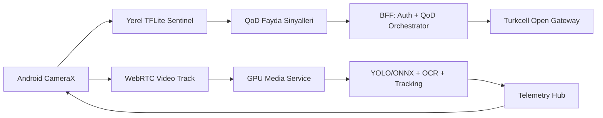

# SİNAPTİC5G Uygulama Dosyası

**Proje:** 5G ve Yapay Zeka ile Akıllı Yol Güvenliği Yarışması  
**Takım / Ürün adı:** SİNAPTİC5G TripWire  
**Kapsam:** Mobil uygulama, canlı 5G akışı, GPU çıkarım servisi ve FTR Docker teslim hattı  
**Hazırlanma amacı:** Projenin baştan sona işleyişini, yarışma şartnamesine uyumunu, uygulama arayüzünü, mimarisini, güçlü yönlerini ve kalan dış bağımlılıkları tek okunabilir dosyada toplamak.

---

## 1. Kısa Yönetici Özeti

SİNAPTİC5G TripWire, yol kenarı veya araç çevresi kamera akışını 5G destekli bir mobil uygulama üzerinden alan, araç yaklaşmasını cihaz üzerinde hafif modelle erken fark eden, gerekli olduğunda Quality on Demand isteği açan ve daha yüksek başarımlı yapay zeka çıkarımını GPU tarafında çalıştıran iki kipli bir yol güvenliği sistemidir.

Sistem iki ayrı ihtiyacı birlikte karşılar:

1. **Final Tasarım Raporu ve otomatik değerlendirme hattı:** `/app/data/input/video.mp4` videosunu okuyan, `/app/data/output/results.json` dosyasını resmi şemaya uygun üreten, ağsız Docker çıkarım paketi.
2. **Canlı 5G uygulama hattı:** Android uygulama, Number Verification doğrulaması, WebRTC kamera yayını, BFF kontrollü QoD oturumu, GPU medya servisi ve kimlikli telemetri akışı.

Bu ayrım bilinçlidir. Yarışma değerlendirmesi için gerekli olan `results.json` üretimi çevrimdışı, deterministik ve Docker içinde çalışır. Canlı 5G gösterimi ise Turkcell Open Gateway erişimi, gerçek SIM, HTTPS/WSS uçları ve TURN/ICE ortamı hazır olduğunda aktifleşir; erişim yoksa uygulama Best Effort ve yerel sentinel kipinde çalışmayı sürdürür.

---

## 2. Yarışma Gereksinimleri ile Uyum

### 2.1 Resmi çıktı sözleşmesi

Çıkış dosyası tek dosyadır:

- Yol: `/app/data/output/results.json`
- Kod sınırı: `5G PROJE/src/competition_contract.py`
- Üretici adapter: `5G PROJE/src/competition_adapter.py`
- JSON şeması: `5G PROJE/schemas/results.schema.json`
- Etiket kontratı: `5G PROJE/label_contract.yaml`

Üretilen JSON yalnız şu kök alanları içerir:

```json
{
  "video_id": "video.mp4",
  "arac_bilgisi": {
    "tip": "sedan",
    "plaka": "34ABC123",
    "renk": "beyaz",
    "confidence_score": 0.94
  },
  "tespitler": []
}
```

`additionalProperties=false` kuralı şemada uygulanır. Bu sayede hakem scriptini bozabilecek `speed`, `bbox`, `track_id`, `debug`, `qod_status` gibi ek alanlar resmi çıktı dosyasına yazılmaz.

### 2.2 Geçerli etiketler

Araç bilgisi:

| Alan | Geçerli değer |
|---|---|
| `tip` | `sedan`, `suv`, `hatchback`, `pickup`, `minibus`, `panelvan`, `kamyon` |
| `plaka` | Türkiye plaka regex formatı, boşluksuz ve büyük harfli |
| `renk` | `beyaz`, `siyah`, `gri`, `kirmizi`, `mavi`, `sari`, `yesil`, `turuncu`, `kahverengi` |
| `confidence_score` | 0.0 ile 1.0 arasında sayı |

Tespitler:

| Kategori | Etiketler |
|---|---|
| `sofor_eylemi` | `arkaya_bakma`, `esneme`, `sigara_icme`, `su_icme`, `telefonla_konusma`, `slalom`, `etrafa_bakinma`, `emniyet_kemeri_ihlali` |
| `nesneler` | `teknocan`, `bilgisayar` |
| `yolcular` | `arka_koltuk_1`, `arka_koltuk_2`, `on_koltuk` |

### 2.3 Teslim kontrol maddeleri

| Kontrol maddesi | Durum | Kanıt / proje karşılığı |
|---|---|---|
| Dockerfile projenin en üst dizininde | Evet | `5G PROJE/Dockerfile` |
| Base image `nvidia/cuda:12.1.0-base-ubuntu22.04` | Evet | Dockerfile `FROM` satırı |
| Program konteyner açılınca otomatik başlıyor | Evet | `ENTRYPOINT ["python3", "/app/main.py"]` |
| Girdi yolu `/app/data/input/video.mp4` | Evet | `ftr_main.py` sabit `INPUT_PATH` |
| Çıktı yolu `/app/data/output/results.json` | Evet | `ftr_main.py` sabit `OUTPUT_PATH` |
| Model ağırlıkları `/app/models/` altında | Evet | Dockerfile seçici model kopyaları |
| JSON anahtarları resmi şemayla birebir | Evet | `schemas/results.schema.json` ve `competition_contract.py` |
| Etiketler ASCII-safe ve küçük harf | Evet | `label_contract.yaml`, normalize/gate fonksiyonları |
| Plaka formatı normalize ediliyor | Evet | `normalize_plate()` |
| Confidence değerleri 0 ile 1 arasında | Evet | `clamp_confidence()` |
| Ağsız FTR çalışması | Evet | FTR acceptance raporu: internet/CAMARA çağrısı yok |
| Model bütünlüğü kilitleniyor | Evet | `model_lock.json` ve `verify_model_lock()` |
| Test videosunda sonuç dosyası üretildi | Evet | `evidence/ftr_acceptance_report.md` |
| Pytest kabul paketi geçti | Evet | `81 passed` kabul raporu |

Not: Canlı Turkcell Number Verification ve QoD çağrıları kodda hazırdır; gerçek sağlayıcı uçları, SIM/onboarding yetkileri ve saha erişimi dış bağımlılıktır. Bu nedenle canlı 5G kanıtı "erişim olduğunda çalıştırılacak" başlığı altında tutulmalıdır. FTR Docker teslimi bu dış erişime bağlı değildir.

---

## 3. Kullanıcı Uygulaması: Telefon Arayüzü ve Akış

Android uygulama yatay ekranda tek operasyon paneli olarak tasarlanmıştır. Sol alan canlı kamera veya test videosu görüntüsünü, sağ panel ise doğrulama, risk, araç, olay, hız, QoD ve bağlantı durumlarını gösterir.

### 3.1 Ekran bölümleri

| Ekran alanı | İşlev |
|---|---|
| Kamera önizleme | CameraX üzerinden canlı görüntü |
| Detection overlay | Yerel sentinel tespit kutuları |
| FPS sayacı | Canlı analiz hızının izlenmesi |
| Giriş kaynağı seçimi | Canlı kamera veya paketli test videoları |
| Telefon numarası alanı | E.164 formatında kullanıcı numarası |
| Numara doğrulama butonu | OIDC Authorization Code + PKCE akışını başlatır |
| Risk skoru | Yerel ve backend birleşik risk görünümü |
| Sürücü davranışı | Anlık davranış sınıfı |
| Plaka | GPU telemetrisiyle gelen plaka |
| Araç tipi / renk | GPU telemetrisiyle gelen özet |
| Olay zamanı | Son olayın zaman damgası |
| Hız tahmini | Backend telemetri alanı |
| 5G QoD durumu | Best Effort, QoD aktif veya kullanılamıyor durumu |
| Telemetri durumu | WebSocket bağlantı durumu |
| Yerel edge sonucu | Cihaz üstü hızlı sentinel sonucu |

### 3.2 Kullanıcı senaryosu

1. Operatör uygulamayı açar.
2. Kamera izni verilir.
3. Giriş kaynağı seçilir: canlı kamera veya test videosu.
4. Telefon numarası girilir.
5. Number Verification akışı başlatılır.
6. Doğrulama başarılıysa uygulama BFF oturum tokenı alır.
7. Android kamera görüntüsü yerel TFLite sentinel tarafından hafifçe analiz edilir.
8. Araç görünür ve yaklaşma sinyali oluşursa QoD fayda kapısı değerlendirilir.
9. Fayda kapısı uygunsa BFF üzerinden QoD oturumu istenir.
10. Kamera akışı WebRTC ile GPU medya servisine aktarılır.
11. GPU servisi yüksek başarımlı çıkarımı yapar.
12. Sonuç telemetrisi WebSocket üzerinden uygulamaya döner.
13. Arayüzde plaka, araç tipi, renk, risk skoru, olay zamanı ve hız güncellenir.
14. Kritik sonuçlar Room veritabanına event id ile idempotent şekilde kaydedilir.

### 3.3 Yerel ve GPU çıkarım ayrımı

Mobil uygulama "her şeyi telefonda yapma" yaklaşımına kilitlenmez. Bunun yerine iki katmanlı bir strateji kullanır:

- **Yerel sentinel:** Android üzerinde TFLite + NNAPI ile hızlı araç varlığı ve yaklaşma sinyali üretir.
- **GPU çıkarımı:** Plaka, araç bilgisi, kabin içi nesne ve sürücü davranışı gibi pahalı görevleri GPU servisinde çalıştırır.

Bu yaklaşım QoD kararını ölçülebilir sinyallere bağlar. Yani QoD sadece "araç var" diye değil, hedef yaklaşırken ve model/network faydası beklenirken istenir.

---

## 4. Canlı Sistem Mimarisi



### 4.1 Android uygulama katmanı

Ana dosyalar:

- `android/app/src/main/java/com/sinaptic/tripwire/MainActivity.kt`
- `android/app/src/main/java/com/sinaptic/tripwire/analysis/FrameProcessor.kt`
- `android/app/src/main/java/com/sinaptic/tripwire/api/NumberVerificationManager.kt`
- `android/app/src/main/java/com/sinaptic/tripwire/api/QoDManager.kt`
- `android/app/src/main/java/com/sinaptic/tripwire/api/WebRtcMediaClient.kt`
- `android/app/src/main/java/com/sinaptic/tripwire/api/TripWireWebSocket.kt`

Görevleri:

- CameraX ile 720p canlı görüntü alır.
- TFLite modelini hash ve tensor kontratıyla doğrular.
- Model bozuk veya eksikse çökmeden "model eksik" durumuna geçer.
- OIDC + PKCE ile Number Verification akışını başlatır.
- Doğrulanmış oturumla WebSocket ve WebRTC bağlantılarını açar.
- QoD isteğini yalnız hedef araç yaklaşırken dener.
- QoD başarısız olursa Best Effort akışını kesmez.

### 4.2 BFF katmanı

Ana dosyalar:

- `5G PROJE/server.py`
- `5G PROJE/api/number_verification.py`
- `5G PROJE/api/qod_client.py`
- `5G PROJE/api/qod_orchestrator.py`
- `5G PROJE/api/webrtc_signaling.py`

Görevleri:

- Android ile sağlayıcı API'leri arasında güvenli sınır oluşturur.
- Sağlayıcı secret ve QoD profil bilgilerini APK içine koymaz.
- Number Verification sonucuna göre yerel app session token üretir.
- QoD oturumunu fayda modeli, cooldown ve sahiplik kontrolüyle yönetir.
- WebRTC için sadece SDP posta kutusu görevi görür.
- RTP, RTCP, ham frame veya görüntü verisi BFF üzerinden taşınmaz.

### 4.3 GPU medya servisi

Ana dosyalar:

- `5G PROJE/media_service.py`
- `5G PROJE/api/latest_frame.py`
- `5G PROJE/api/vehicle_sentinel.py`
- `5G PROJE/api/telemetry_hub.py`

Görevleri:

- BFF'den SDP offer alır, answer üretir.
- Android'den doğrudan WebRTC video track alır.
- Her peer için kapasite-1 latest-frame queue kullanır.
- Geciken eski kareleri düşürür, canlı gecikmeyi büyütmez.
- GPU çıkarım sonuçlarını `event_id` ile telemetriye yayınlar.
- Bağlanan cihaz yalnız kendi snapshot ve sonuçlarını alır.

### 4.4 Çevrimdışı FTR Docker katmanı

Ana dosyalar:

- `5G PROJE/Dockerfile`
- `5G PROJE/ftr_main.py`
- `5G PROJE/src/competition_adapter.py`
- `5G PROJE/src/competition_contract.py`
- `5G PROJE/schemas/results.schema.json`

Görevleri:

- Tek video dosyasını okur.
- Model kilidini doğrular.
- Video karelerini OpenCV ile çözer.
- Araç, renk, plaka ve olay gözlemlerini toplar.
- Track bazında özetleme yapar.
- Sadece resmi şemaya uygun `results.json` üretir.
- Dosyayı atomik yazar.
- Hata olursa yarım/geçersiz sonuç bırakmaz.

---

## 5. Yapay Zeka İşleyişi

### 5.1 Model ve görev dağılımı

| Görev | Çözüm yaklaşımı | Çalışma yeri |
|---|---|---|
| Araç varlığı | YOLO tabanlı dedektör | Android sentinel ve GPU |
| Araç tipi | COCO/custom sınıf eşleme ve track özetleme | FTR/GPU |
| Araç rengi | HSV tabanlı gövde renk tahmini | FTR/GPU |
| Plaka alanı | Custom dedektör | FTR/GPU |
| Plaka OCR | LPRNet/CRNN ve temporal smoothing | FTR/GPU |
| Sürücü eylemi | Custom dedektör, head pose, temporal sinyaller | FTR/GPU |
| Slalom | BEV tabanlı takip ve yön değişimi | FTR/GPU |
| Yolcu/nesne | Kabin ROI ve sınıf eşleme | FTR/GPU |
| Düşük ışık | Zero-DCE koşullu iyileştirme | FTR/GPU |

### 5.2 Olay üretimi

Model çıktıları doğrudan yarışma JSON'una basılmaz. Önce iç olaylar toplanır:

1. Kare bazlı tespit yapılır.
2. Araçlar track id ile takip edilir.
3. Plaka, renk ve araç tipi track boyunca biriktirilir.
4. Olaylar zamansal segmentlere ayrılır.
5. Aynı olayın ardışık tespitleri birleştirilir.
6. En iyi temsil zamanı ve ortalama güven skoru seçilir.
7. Geçersiz etiketler düşürülür.
8. JSON şeması doğrulanır.

Bu sayede tek bir hatalı kare tüm video sonucunu bozmaz; çıktı daha kararlı ve hakem sözleşmesine daha yakın kalır.

### 5.3 Dayanıklılık önlemleri

- Değişken FPS için zaman damgası bazlı örnekleme.
- CPU/GPU durumuna göre adaptif stride.
- Düşük ışıkta koşullu görüntü iyileştirme.
- Takip tabanlı agregasyon.
- Plaka için normalize ve regex kontrolü.
- Model hash doğrulaması.
- Atomik JSON yazımı.
- Şema dışı alan engelleme.
- Ağsız FTR çalışma hattı.

---

## 6. Teslim Paketi Mantığı

FTR tesliminde ana hedef, hakemin tek komutla imajı build edip çalıştırabilmesidir.

Beklenen yerleşim:

```text
5G PROJE/
  Dockerfile
  requirements-ftr.txt
  ftr_main.py
  plate_ocr.py
  driver_analyzer.py
  risk_scorer.py
  model_lock.json
  schemas/results.schema.json
  src/
  models/
```

Dockerfile `COPY . .` kullanmaz; seçici kopyalama yapar. Bu karar imaj boyutunu düşürür ve gereksiz veri seti, cache, eğitim koşusu, APK, PDF veya kişisel dosyaların imaja girmesini engeller.

İmaj içinde beklenen kritik dosyalar:

| Konteyner yolu | Amaç |
|---|---|
| `/app/main.py` | FTR giriş noktası |
| `/app/models/coco.onnx` | Genel araç tespiti |
| `/app/models/detector_optimized.onnx` | Yarışma sınıfları dedektörü |
| `/app/models/lprnet.onnx` | Plaka bölgesi destek modeli |
| `/app/models/crnn.onnx` | Plaka OCR |
| `/app/schemas/results.schema.json` | JSON doğrulama |
| `/app/model_lock.json` | Model bütünlük kilidi |

---

## 7. Projenin Avantajları

### 7.1 Yarışma sözleşmesine sıkı uyum

Resmi etiketler tek kaynakta tutulur. Kod, belge ve şema aynı vocabulary'yi kullanır. Bu, küçük harf, Türkçe karakter ve yanlış anahtar hatalarını azaltır.

### 7.2 5G değerini gerçek senaryoya bağlama

QoD kararı yalnız network özelliği göstermeye çalışmaz; araç yaklaşması, tanınabilirlik açığı, model belirsizliği, medya bozulması ve network bozulması gibi sinyallerle gerekçelendirilir.

### 7.3 Güvenli canlı mimari

APK içine sağlayıcı secret konmaz. BFF yalnız kontrol ve SDP sınırında kalır. Ham kamera görüntüsü REST veya WebSocket ile BFF'ye taşınmaz.

### 7.4 Düşük gecikme yaklaşımı

GPU servisinde kapasite-1 latest-frame queue kullanılması, yoğunlukta eski karelerin birikmesini engeller. Bu tasarım canlı sistemlerde "her kareyi işleyeyim" yerine "en güncel kareyle karar vereyim" yaklaşımını benimser.

### 7.5 Çift kipli güvenilirlik

Canlı demo dış erişime bağlı olsa bile FTR Docker hattı bağımsızdır. Operatör API erişimi yoksa bile yarışma çıktısı üreten offline değerlendirme yolu korunur.

### 7.6 Ölçeklenebilir servis sınırları

Android, BFF ve GPU servisleri ayrı sorumluluklara sahiptir. Bu sayede:

- Mobil uygulama sade kalır.
- Sağlayıcı API entegrasyonları sunucuda izole edilir.
- GPU çıkarımı yatay ölçeklenebilir.
- Telemetri cihaz bazlı ayrıştırılır.

### 7.7 Kanıt üretme disiplini

Projede test, kabul raporu, model lock, şema validasyonu, APK taraması, latency benchmark ve kalite kapısı ayrı dosyalarla belgelenmiştir. Bu, jüri önünde "çalışıyor" demekten daha güçlü bir pozisyondur: hangi parçanın ölçüldüğü, hangisinin dış erişim beklediği ayrıdır.

---

## 8. Mevcut Kanıt Dosyaları

| Kanıt | Dosya |
|---|---|
| FTR kabul testi | `5G PROJE/evidence/ftr_acceptance_report.md` |
| JSON schema validasyonu | `5G PROJE/evidence/results_schema_validation.json` |
| Label kontratı validasyonu | `5G PROJE/evidence/label_contract_validation.json` |
| Final kalite kapısı | `5G PROJE/reports/final_quality_gate.md` |
| Final doğrulama çizelgesi | `5G PROJE/reports/final_validation_checklist.md` |
| Model lock | `5G PROJE/model_lock.json` |
| Model hash listesi | `5G PROJE/evidence/model_hashes.txt` |
| Android APK taraması | `5G PROJE/evidence/apk_scan_v5.log` |
| Android build log | `5G PROJE/evidence/gradle_assemble_debug.log` |
| Dataset manifest | `5G PROJE/evidence/dataset_manifest.md` |
| Robustness raporu | `5G PROJE/evidence/robustness_report.md` |
| Error analysis | `5G PROJE/evidence/error_analysis_report.md` |
| Yarışma günü kontrol listesi | `YARISMA_GUNU_KONTROL_LISTESI.md` |

---

## 9. Eksikliği Giderilen Anlatı Noktaları

Bu dosyanın tamamladığı boşluklar:

1. Mobil uygulamanın yalnız ekran değil, uçtan uca operasyon akışı olarak anlatılması.
2. Number Verification, QoD, WebRTC, GPU ve FTR Docker parçalarının tek senaryoda bağlanması.
3. "Tümünü evet yapmalıyız" kontrolünün FTR Docker maddeleri için açık tabloya dökülmesi.
4. Canlı 5G dış bağımlılıklarının dürüst şekilde ayrılması.
5. Projenin avantajlarının yarışma perspektifiyle özetlenmesi.
6. Jüriye anlatılacak sistem işleyişinin teknik ve anlaşılır tek dosyada toplanması.

---

## 10. Sonraki Aşama İçin Komut Uygulama Sırası

Bu dosya komut çalıştırma rehberi olarak değil, uygulama ve proje dosyası olarak hazırlandı. Sonraki sorguda istenirse şu sırayla adım adım komutlandırılmalıdır:

1. FTR Python bağımlılık ve şema kontrolü.
2. Pytest kabul koşusu.
3. Model lock/hash doğrulaması.
4. FTR Docker build.
5. FTR Docker run ve `results.json` üretimi.
6. Docker imaj boyutu kontrolü.
7. Android model asset lock kontrolü.
8. Android debug APK build.
9. APK sır ve model taraması.
10. Canlı BFF, medya servisi ve Redis ayağa kaldırma.
11. Gerçek endpointlerle Number Verification denemesi.
12. QoD start/stop testi.
13. Android-WebRTC-GPU uçtan uca canlı akış testi.
14. Teslim paketinin son hash ve boyut kaydı.

Yeni sorguda bu listeyi çalıştırılabilir komutlara dönüştürüp sırayla ilerleyebiliriz.

---

## 11. Nihai Hazırlık Beyanı

SİNAPTİC5G TripWire projesi, yarışmanın yapay zeka çıkarımı ve resmi `results.json` üretimi açısından şema kontrollü, Docker ile paketlenebilir ve kanıt dosyalarıyla izlenebilir durumdadır. Mobil uygulama tarafında kullanıcı doğrulama, kamera arayüzü, yerel sentinel, QoD tetikleme, WebRTC medya aktarımı ve telemetri ekranı tasarlanmış ve kod seviyesinde yerleştirilmiştir. Canlı 5G doğrulama adımı, sağlayıcı erişimi ve saha ortamı sağlandığında son kabul testi olarak yürütülmelidir.

Bu haliyle proje; yalnız model geliştiren bir prototip değil, yarışma günü çalıştırma, doğrulama, hata kurtarma ve jüri anlatımı düşünülmüş uçtan uca bir akıllı yol güvenliği uygulamasıdır.
